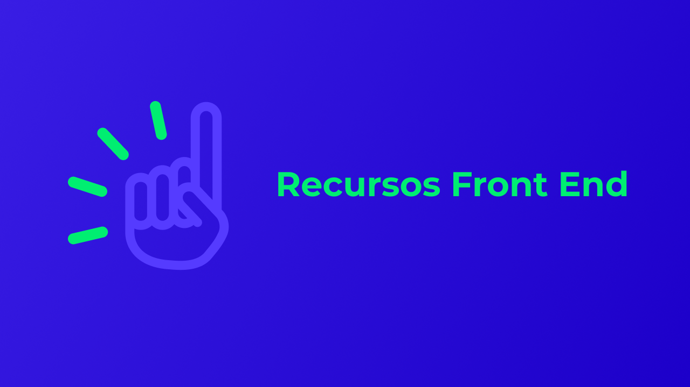

## HTML
[Dive Into HTML5](https://diveintohtml5.com.br)    
[HTML5 Boilerplate](https://html5boilerplate.com)   
[Índice de elementos HTML](http://html5doctor.com/element-index)    
[Referência HTML da MDN](https://developer.mozilla.org/pt-BR/docs/Web/HTML/Element)    
[Validador de código HTML](https://validator.w3.org)    
## CSS
[animista](https://animista.net/)  
[Animate.css](https://animate.style)    
[Autoprefixer](http://autoprefixer.github.io)   
[Box Shadow CSS Generator](https://www.cssmatic.com/box-shadow)    
[Calculadora de especificidade CSS](https://specificity.keegan.st)    
[Can I Use](https://caniuse.com)  
[CSS clip-path maker](https://bennettfeely.com/clippy/)  
[Contrast Ratio](https://contrast-ratio.com/)    
[CSS Formatter](https://www.cleancss.com/css-beautify)    
[CSS Gradient](https://cssgradient.io/?fbclid=IwAR0dQD8FCAVJAgzq9p-TgNZn9SkLXgoJrL41XOkzL7eETZ0f6NA7xpPJglo)   
[CSS Validation Service](https://jigsaw.w3.org/css-validator)    
[cubic-bezier](https://cubic-bezier.com)    
[Easing functions](https://easings.net)    
[How To Center](http://howtocenterincss.com)    
[Referência CSS da MDN](https://developer.mozilla.org/en-US/docs/Web/CSS/Reference)  
## JAVASCRIPT
[Animate On Scroll](https://michalsnik.github.io/aos)  
[GreenSock](https://greensock.com/gsap)   
[Momentjs](https://momentjs.com)  
[Microjs](http://microjs.com/)    
[move.js](https://github.com/visionmedia/move.js)  
[Moving Letters](https://tobiasahlin.com/moving-letters/)  
[Referência de Eventos JavaScript](https://developer.mozilla.org/pt-BR/docs/Web/Events)    
[Referência JavaScript da MDN](https://developer.mozilla.org/pt-BR/docs/Web/JavaScript/Reference)     
[regex101](https://regex101.com)      
[Swiper](https://swiperjs.com)   
[Skrollr](https://prinzhorn.github.io/skrollr/)   
[three.js](https://threejs.org)  
[vivus.js](https://maxwellito.github.io/vivus)  
[velocityjs](http://velocityjs.org/)  
[You might not need jQuery](http://youmightnotneedjquery.com/)    

## FONTES 
[Adobe Fonts](https://fonts.adobe.com)      
[CSS Font Stack](https://www.cssfontstack.com)      
[Font Combinations](https://www.canva.com/font-combinations)        
[FontPair](https://fontpair.co)      
[FontSquirrel](https://www.fontsquirrel.com)        
[Google Fonts](https://fonts.google.com)      
[Just My Type](https://justmytype.co)      
[Modular Scale](https://www.modularscale.com)    
[transfonter](https://transfonter.org)      
[Typechem](https://typechem.herokuapp.com)      
## ÍCONES
[Boxicons](https://boxicons.com/)      
[css.gg](https://css.gg/)      
[Eva Icons](https://akveo.github.io/eva-icons/)  
[Favicon Generator](https://realfavicongenerator.net)  
[Feather](https://feathericons.com/)  
[Flaticon](https://www.flaticon.com)  
[Font Awesome](https://fontawesome.com)  
[Free icons](https://freeicons.io)  
[freeicons.io](https://freeicons.io/)  
[Freepik](https://br.freepik.com/)  
[Heroicons](https://heroicons.dev/)  
[Icon Icons](https://icon-icons.com/)  
[Iconfinder](https://www.iconfinder.com/free_icons)   
[IconMoon](https://icomoon.io)  
[Icons8](https://icons8.com.br)   
[Iconscout](https://iconscout.com/)   
[Iconsvg](https://iconsvg.xyz/)  
[Ikonate](https://ikonate.com/)  
[Ionicons](https://ionicons.com/)  
[Line Awesome](https://icons8.com/line-awesome)  
[Newsbi Icon Pack](https://gumroad.com/l/lfdy)  
[Noun Project](https://thenounproject.com)  
[Radix Icons](https://icons.modulz.app)  
[Remix Icon](https://remixicon.com/)  
[shape.so](https://shape.so/)  
[Simple Icons](https://simpleicons.org/)  
[Steamline Free](https://www.streamlineicons.com/free/)  
[Streamline UX](https://www.streamlineicons.com/ux/)  
[Tabler Icons](https://tablericons.com/)  
[Tilda Icons](https://tilda.cc/free-icons/)  
## CORES
[0to255](https://www.0to255.com)  
[Adobe Color](https://color.adobe.com/pt/create/color-wheel)    
[Brand Palettes](https://brandpalettes.com)  
⁣[calcolor.co⁣](calcolor.co⁣)  
[Color Hunt](https://colorhunt.co)  
[Color.review](https://color.review)     
[Colorfavs](http://www.colorfavs.com)  
[Color-hex](https://www.color-hex.com)  
⁣[ColorKit](colorkit.io⁣)  
[Colorsinspo](colorsinspo.com⁣)  
[ColorSuply](https://colorsupplyyy.com/app)   
[ColorZilla](https://www.colorzilla.com)  
[colourco.de](https://colourco.de)  
[Contrast Ratio](https://contrast-ratio.com)  
[Coolors](https://coolors.co)  
[Culrs](https://www.culrs.com⁣)    
[Design Seeds](https://www.design-seeds.com)  
[Flat Ui Colors](https://flatuicolors.com)    
⁣[Khroma](khroma.co⁣)    
[Name that Color](https://chir.ag/projects/name-that-color/#6195ED)  
[Paletton](http://paletton.com/#uid=1000u0kllllaFw0g0qFqFg0w0aF)  
[Scheme Color](https://www.schemecolor.com)  
[Tint and Shade Generator](https://maketintsandshades.com)  
[uiGradients](https://uigradients.com)  
## ILUSTRAÇÕES
[3000 Hands](https://www.shapefest.com/expansions/3000-hands)    
[404 illustrations by kapwing](https://www.kapwing.com/404-illustrations)  
[404 illustrations](https://error404.fun/)  
[Abstrakt](https://www.abstrakt.design/)  
[Absurd Design](https://absurd.design/)  
[Ara Illustration](https://www.aracreator.com/)  
[Black illustrations](https://www.blackillustrations.com)  
[Blob Marker](https://www.blobmaker.app/)  
[Blush](https://blush.design/)  
[Construtor de Ilustrações](https://itg.digital/)  
[Control](https://control.rocks)  
[Delesign](https://delesign.com/)  
[Design.ai](https://designs.ai/graphicmaker/)  
[DrawKit](https://www.drawkit.io)  
[Flow Lava](https://flowlava.club)  
[freellustrations](https://freellustrations.com/)  
[Fresh Folk](https://fresh-folk.com/)  
[Get Waves](https://getwaves.io/)  
[GetIllustrations.com](https://www.getillustrations.com/illustration-packs/freebie)  
[Glaze](https://www.glazestock.com/)  
[Growww](https://growwwkit.com/illustrations/phonies/)  
[Humaaans](https://www.humaaans.com/)  
[Illustrations](https://illlustrations.co/)  
[IRA Design](https://iradesign.io/)  
[Karthik Srinivas](https://www.karthiksrinivas.in/)  
[Kukla Kit](https://www.kukla-kit.com/)  
[Logo Maker](https://www.brandcrowd.com/)  
[Lukasadam](https://lukaszadam.com/illustrations)  
[Manypixels Illustration Gallery](https://www.manypixels.co/gallery/)  
[Mega Doodles Pack](https://github.com/MariaLetta/mega-doodles-pack)  
[Mixkit Art](https://mixkit.co/free-stock-art/)  
[Open Doodles](https://www.opendoodles.com/)  
[Open Peeps](https://www.openpeeps.com/)  
[Ouch](https://icons8.com/illustrations)  
[Paper Illustrations](https://iconscout.com/paper-illustrations)  
[Sapiens](https://sapiens.ui8.net/)  
[Scribbles](https://www.scribbbles.design/)  
[Smash Illustrations](https://usesmash.com/)  
[Stories by Freepik](https://stories.freepik.com)  
[storytale.io](https://storytale.io)  
[Stubborn Generator](https://stubborn.fun/)  
[Toy Faces](https://amritpaldesign.com/toy-faces)  
[Undraw](https://undraw.co)  
[Vector Creator](https://icons8.com/vector-creator/)  
[Whoosh! Illustration Kit](https://www.ls.graphics/illustrations/whoosh)  
## IMAGENS
[everypixel](everypixel.com⁣)  
[Freepik](https://br.freepik.com)  
[isorepublic](isorepublic.com⁣)  
[Pexels](https://www.pexels.com)      
[pixabay](https://pixabay.com)     
[Responsive BreakPoints](https://www.responsivebreakpoints.com/)  
[reshot](reshot.com⁣)  
[Unsplash](https://unsplash.com)     
[kaboompics](kaboompics.com⁣)  
## COMPRESSOR DE IMAGENS
[TinyPNG](https://tinypng.com/)  
[websiteplanet](https://www.websiteplanet.com/webtools/imagecompressor/)      
## AVATARES
[Avatar Generator](https://getavataaars.com)  
[Random User Generator](https://randomuser.me)  
[Ui Faces](https://uifaces.co)  
## PERFORMANCE
[GTmetrix](https://gtmetrix.com)    
[Image Analysis Tool](https://webspeedtest.cloudinary.com)  
[PageSpeed Insight](https://developers.google.com/speed/pagespeed/insights/?hl=pt-br)   
[WebPagetest](https://www.webpagetest.org)  
## CHALLENGES
[30 days CSS](https://30dayscss.vercel.app/challengesList)  
[Codier](https://codier.io/)  
[CSS Battle](https://cssbattle.dev)   
[DevChallenge](https://devchallenge.com.br/challenges/frontend)  
[Edabit](https://edabit.com/challenges/javascript)  
[Front-end Challenges](https://github.com/felipefialho/frontend-challenges)  
[Frontend Mentor](https://www.frontendmentor.io/)  
[JSBeginners](https://jsbeginners.com/)  
[JSchallenger](https://www.jschallenger.com/)  
[WoMakersCode Front-end Challenges](https://github.com/WoMakersCode/challenges-front-end)  
## INSPIRAÇÕES
[Awwwards](awwwards.com)  
[CollectUI](https://collectui.com)  
[Dribbble](https://dribbble.com)  
[Httpster](https://httpster.net/2020/apr/)  
[interfacely](https://www.instagram.com/interfacely/)  
[One Page Love](https://onepagelove.com)  
[Site Inspire](https://siteinspire.com)  
## CHROME WEB STORE 
[ColorZilla](https://chrome.google.com/webstore/detail/colorzilla/bhlhnicpbhignbdhedgjhgdocnmhomnp?hl=pt-BR)   
[GoFullPage - Full Page Screen Capture](https://chrome.google.com/webstore/detail/gofullpage-full-page-scre/fdpohaocaechififmbbbbbknoalclacl?hl=pt-BR)  
[JSON Viewer](https://chrome.google.com/webstore/detail/json-viewer/gbmdgpbipfallnflgajpaliibnhdgobh?hl=pt-BR)  
[Loom for Chrome](https://chrome.google.com/webstore/detail/loom-for-chrome/liecbddmkiiihnedobmlmillhodjkdmb?hl=pt-BR)  
[Page Ruler Redux](https://chrome.google.com/webstore/detail/page-ruler-redux/giejhjebcalaheckengmchjekofhhmal?hl=pt-BR)   
[Web Developer](https://chrome.google.com/webstore/detail/web-developer/bfbameneiokkgbdmiekhjnmfkcnldhhm?hl=pt-BR)  
[WhatFont](https://chrome.google.com/webstore/detail/whatfont/jabopobgcpjmedljpbcaablpmlmfcogm?hl=pt-BR)  
## PLACEHOLDER
[Lorempixel](http://lorempixel.com)  
[Placeholder](https://placeholder.com)  
[Placekitten](https://placekitten.com)   
## EMOJI
[Get Emoji](https://getemoji.com/)
## REMOVE BACKGROUND
[remove.bg](https://www.remove.bg)
## EDITOR DE MARKDOWN
[StackEdit](https://stackedit.io)  
[Typora](https://typora.io/)  
## HOST GRATUITO  
[InfinityFree](https://infinityfree.net/)  
[Netlify](https://www.netlify.com/)  
[000WebHost](https://br.000webhost.com/)  
