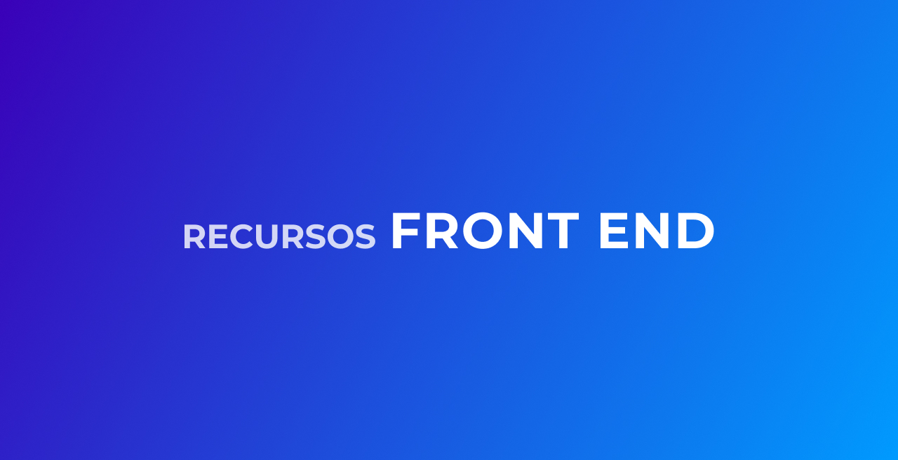

Quer contribuir com o repositório? Faça um fork e abra um Pull request 👊🏽  
Conteúdos deverão seguir a ordem alfabética.

## Indice

* [Avatares](#avatares)
* [Compartilhar fragmento de código](#compartilhar-fragmento-codigo)
* [Compressor de imagens](#compressor-imagens)
* [Cores](#cores)
* [CSS](#css)
* [Desafios](#desafios)
* [Edição de imagens](#edicao-imagens)
* [Editor de Markdown](#editor-markdown)
* [Emoji](#emoji)
* [Extensões do Chrome](#extensoes-chrome)
* [Fontes](#fontes)
* [Host gratuito](#host-gratuito)
* [HTML](#html)
* [Icones](#icones)
* [Ilustrações](#ilustracoes)
* [Imagens](#imagens)
* [Inspirações](#inspiracoes)
* [JavaScript](#javascript)
* [Minifier](#minifier)
* [Performance](#performance)
* [Placeholder](#placeholder)
* [Prototipação](#prototipacao)
* [Templates HTML/CSS](#templates-html-css)
* [Remove background](#remove-background)
* [UI Kits](#ui-kits)

### Avatares
Link | Descrição | Grátis |
|---|---|---|
| [Avatar Generator](https://getavataaars.com) | Gerador de avatar para qualquer um fazer seu avatar pessoal facilmente | Sim | Yes | No |
| [Random User Generator](https://randomuser.me) | API para gerar dados aleatórios de usuário | Sim | Yes | No |
| [Ui Faces](https://uifaces.co) | Plugin / API de avatar | Um mês | Yes | No |

**[⬆ Voltar para o indice](#indice)**

## Compartilhar fragmento de código
Link | Descrição | Grátis |
|---|---|---|
| [Carbon](https://carbon.now.sh/) | Crie e compartilhe belas imagens de seu código-fonte | Sim | Yes | No |

**[⬆ Voltar para o indice](#indice)**

## Compressor de imagens
Link | Descrição | Grátis |
|---|---|---|
| [TinyPNG](https://tinypng.com/) | Compressão inteligente de PNG e JPEG | Sim | Yes | No |
| [websiteplanet](https://www.websiteplanet.com/webtools/imagecompressor/) | Comprima seus arquivos PNG / JPG em até 80% e mantenha total transparência | Sim | Yes | No |

**[⬆ Voltar para o indice](#indice)**

## CORES
Link | Descrição | Grátis |
|---|---|---|
| [0to255](https://www.0to255.com) | Ferramenta de cor que facilita o clareamento e o escurecimento das cores | Sim | Yes | No |
| [Adobe Color](https://color.adobe.com/pt/create/color-wheel) | Gerador de paleta de cores | Sim | Yes | No |
| [Brand Palettes](https://brandpalettes.com) | Códigos de cores e paletas do logotipo | Sim | Yes | No |
| [calcolor.co](https://calcolor.co/) | Crie paletas específicas para projetos e compartilhe-as com outras pessoas | Sim | Yes | No |
| [Color Hunt](https://colorhunt.co) | Plataforma para inspiração de cores com milhares de paletas de cores  | Sim | Yes | No |
| [Color.review](https://color.review) | Avalia contraste entre texto e background | Sim | Yes | No |
| [Color-hex](https://www.color-hex.com) | Fornece informações sobre cores, incluindo modelos de cores (RGB, HSL, HSV e CMYK) | Sim | Yes | No |
| [ColorKit](colorkit.io) | Gera escalas de cores misturando os tons entre duas cores  | Sim | Yes | No |
| [ColorsLol](https://colors.lol) | Paletas de cores excessivamente descritivas | Sim | Yes | No |
| [Colorsinspo](colorsinspo.com) | Paletas de cores que você pode usar diretamente com um clique | Sim | Yes | No |
| [ColorSuply](https://colorsupplyyy.com/app) | Um seletor de cores para designers e ilustradores | Sete visitas | Yes | No |
| [ColorZilla](https://www.colorzilla.com) | Um poderoso editor de gradiente CSS semelhante ao Photoshop da ColorZilla | Sim | Yes | No |
| [colourco.de](https://colourco.de) | Ferramenta de design online que permite combinar cores de forma fácil e intuitiva | Sim | Yes | No |
| [Contrast Ratio](https://contrast-ratio.com) | Indicador de contraste | Sim | Yes | No |
| [Coolors](https://coolors.co) | Crie a paleta perfeita ou inspire-se com milhares de belos esquemas de cores | Sim | Yes | No |
| [Culrs](https://www.culrs.com) | As cores que funcionam juntas são selecionadas e moldadas em paletas de qualidade que você pode incorporar | Sim | Yes | No |
| [Design Seeds](https://www.design-seeds.com) | Várias paletas de cores | Sim | Yes | No |
| [Flat Ui Colors](https://flatuicolors.com) | Um conjunto total de 280 cores está ao seu alcance para COPIAR / COLAR para seu próximo projeto, design, apresentação | Sim | Yes | No |
| [Khroma](http://khroma.co/) | Usa IA para aprender de quais cores você gosta e cria paletas ilimitadas para você descobrir, pesquisar e salvar | Sim | Yes | No |
| [Name that Color](https://chir.ag/projects/name-that-color/#6195ED) | Informa o nome da cor escolhida | Sim | Yes | No |
| [Paletton](http://paletton.com/#uid=1000u0kllllaFw0g0qFqFg0w0aF) | Projetado para ajudar todos os tipos de projetos coloridos, desde o trabalho profissional até os projetos escolares dos seus filhos | Sim | Yes | No |
| [Scheme Color](https://www.schemecolor.com) | Um site bem cotado para baixar, criar e compartilhar milhares de belas combinações de cores | Sim | Yes | No |
| [Tint and Shade Generator](https://maketintsandshades.com) | Crie facilmente tons e sombras que correspondam à saída do Chrome DevTools, PostCSS e Sass | Sim | Yes | No |
| [uiGradients](https://uigradients.com) | Uma coleção escolhida a dedo de lindos gradientes de cores para designers e desenvolvedores | Sim | Yes | No |

**[⬆ Voltar para o indice](#indice)**

## Desafios
Link | Descrição | Grátis |
|---|---|---|
| [30 days CSS](https://30dayscss.vercel.app/challengesList) | 30 desafios de css. | Sim | Yes | No |
| [Ace Front-end](https://www.acefrontend.com/) | Ace Front End tem desafios de codificação completos e práticos, com um passeio detalhado de uma solução de entrevista perfeita. | Sim | Yes | No |
| [App Ideas](https://github.com/florinpop17/app-ideas) | Repositorio com diversos projetos separados por niveis. Esta não é apenas uma lista simples de projetos, mas uma coleção que descreve cada projeto em detalhes suficientes para que você possa desenvolvê-lo do zero. | Sim | Yes | No |
| [Codier](https://codier.io/) | Explore e tente desafios de codificação de front-end. | Sim | Yes | No |
| [CSS Battle](https://cssbattle.dev) | Use suas habilidades de CSS para replicar desafios com o menor código possível. | Sim | Yes | No |
| [DevChallenge](https://devchallenge.com.br) | Melhore suas habilidades com desafios de front-end, back-end e mobile. | Sim | Yes | No |
| [Edabit](https://edabit.com/challenges) | Nossos desafios pequenos são um atalho no labirinto de aprender a codificar. Ganhe XP, desbloqueie conquistas e suba de nível. Fique realmente bom em codificação, muito rápido. | Sim | Yes | No |
| [Front-end Challenges](https://github.com/felipefialho/frontend-challenges) | O principal objetivo do repositório é testar seu conhecimento usando o desafio de empregos reais. | Sim | Yes | No |
| [Frontend Mentor](https://www.frontendmentor.io/) | Resolva desafios reais de HTML, CSS e JavaScript enquanto trabalha com designs profissionais. Junte-se a 170.842 desenvolvedores que criam projetos, revisam códigos e ajudam uns aos outros a melhorar. | Sim | Yes | No |
| [JSBeginners](https://jsbeginners.com/) | Obtenha mais de 100 ótimas ideias para JavaScript iniciante | Sim | Yes | No |
| [JSchallenger](https://www.jschallenger.com/) | Desafios de Javascript grátis. Aprenda Javascript online resolvendo exercícios de codificação. Javascript para todos os níveis. Resolva tarefas Javascript do iniciante ao avançado. | Sim | Yes | No |
| [WoMakersCode Front-end Challenges](https://github.com/WoMakersCode/challenges-front-end) | Uma série de desafios e tutoriais sobre Desenvolvimento Front-end. | Sim | Yes | No |

**[⬆ Voltar para o indice](#indice)**

## Host Gratuito
Link | Descrição | Grátis |
|---|---|---|
| [000WebHost](https://br.000webhost.com/) | Hospedagem de Sites Grátis com PHP, MySQL, Criador de Sites grátis, cPanel e sem anúncios. Sua hospedagem de sites é quase ilimitada e com domínio. | Sim | Yes | No |
| [Github Pages](https://pages.github.com/) | Hospedado diretamente de seu repositório GitHub. Basta editar, enviar por push e suas alterações estarão ativas. | Sim | Yes | No |
| [Heroku](https://www.heroku.com/) | Heroku é uma plataforma como serviço (PaaS) que permite aos desenvolvedores construir, executar e operar aplicativos inteiramente na nuvem. | Sim | Yes | No |
| [InfinityFree](https://infinityfree.net/) | Hospedagem de sites totalmente gratuita com espaço em disco e largura de banda ilimitados. | Sim | Yes | No |
| [Netlify](https://www.netlify.com/) | Um fluxo de trabalho intuitivo baseado em Git e uma plataforma sem servidor poderosa para construir, implantar e colaborar em aplicativos da web. | Sim | Yes | No |
| [Vercel](https://vercel.com/dashboard) | O Vercel combina a melhor experiência do desenvolvedor com um foco obsessivo no desempenho do usuário final. Nossa plataforma permite que as equipes de front-end façam seu melhor trabalho. | Sim | Yes | No |

**[⬆ Voltar para o indice](#indice)**

## HTML
Link | Descrição | Grátis |
|---|---|---|
| [Dive Into HTML5](https://diveintohtml5.com.br) | Seleção de funcionalidades da especificação da HTML5 e outras especificações interessantes escolhidas a dedo. | Sim | Yes | No |
| [HTML5 Boilerplate](https://html5boilerplate.com) | Ajuda você a criar sites ou aplicativos da web rápidos, robustos e adaptáveis. | Sim | Yes | No |
| [Índice de elementos HTML](http://html5doctor.com/element-index) |Referência rápida de elementos que são novos ou foram redefinidos em HTML5. | Sim | Yes | No |
| [Referência HTML da MDN](https://developer.mozilla.org/pt-BR/docs/Web/HTML/Element) | Esta página lista todos os elementos HTML. Eles são agrupados por função para ajuda-lo a achar o que quer fácilmente. | Sim | Yes | No |
| [Validador de código HTML](https://validator.w3.org) | Este validador verifica a validade da marcação de documentos da Web em HTML, XHTML, SMIL, MathML, etc. | Sim | Yes | No |

**[⬆ Voltar para o indice](#indice)**

## Edição de Imagens
Link | Descrição | Grátis |
|---|---|---|
| [Photopea](https://www.photopea.com/) | O Online Photo Editor permite editar fotos, aplicar efeitos, filtros, adicionar texto, cortar ou redimensionar imagens. | Sim | Yes | No |
| [Canva](https://www.canva.com/) | Uma plataforma de design gráfico que permite aos usuários criar gráficos de mídia social, apresentações, infográficos, pôsteres e outros conteúdos visuais.  | Sim | Yes | No |

**[⬆ Voltar para o indice](#indice)**

## Editor de Markdown
Link | Descrição | Grátis |
|---|---|---|
| [StackEdit](https://stackedit.io) | Você pode sincronizar seus arquivos com o Google Drive, Dropbox e GitHub. Ele também pode publicá-los como postagens de blog no Blogger, WordPress e Zendesk. | Sim | Yes | No |
| [Typora](https://typora.io/) | Ele remove a janela de visualização, o alternador de modo, os símbolos de sintaxe do código-fonte do markdown. E fornece um recurso de visualização ao vivo. | Sim | Yes | No |

**[⬆ Voltar para o indice](#indice)**

## Emoji
Link | Descrição | Grátis |
|---|---|---|
| [Get Emoji](https://getemoji.com/) | Copie e cole emojis para Twitter, Facebook, Slack, Instagram, Snapchat, Slack, GitHub, Instagram, WhatsApp e muito mais. | Sim | Yes | No |
| [Emojipedia](https://emojipedia.org/) | O mecanismo de pesquisa de emoji. Uma experiência de pesquisa rápida de emoji com opções para navegar por cada emoji por nome, categoria ou plataforma. | Sim | Yes | No |

**[⬆ Voltar para o indice](#indice)**

## Extensões do Chrome
Link | Descrição | Grátis |
|---|---|---|
| [axe - Web-Acessibility-Testing](https://chrome.google.com/webstore/detail/axe-web-accessibility-tes/lhdoppojpmngadmnindnejefpokejbdd/related?hl=en) | Encontre e corrija problemas de acessibilidade em seu site usando a extensão ax DevTools Chrome. | Sim | Yes | No |
| [ColorZilla](https://chrome.google.com/webstore/detail/colorzilla/bhlhnicpbhignbdhedgjhgdocnmhomnp?hl=pt-BR) | Conta-gotas avançada, seletor de cores, gerador de gradiente e outras guloseimas coloridas. | Sim | Yes | No |
| [Fonts Ninja](https://chrome.google.com/webstore/detail/fonts-ninja/eljapbgkmlngdpckoiiibecpemleclhh?hl=pt-BR) | Identifique fontes de qualquer site da Web, marque, experimente e compre-as. | Sim | Yes | No |
| [GoFullPage](https://chrome.google.com/webstore/detail/gofullpage-full-page-scre/fdpohaocaechififmbbbbbknoalclacl?hl=pt-BR) | Capture uma screenshot de sua página atual inteira sem solicitar nenhuma permissão extra! | Sim | Yes | No |
| [JSON Viewer](https://chrome.google.com/webstore/detail/json-viewer/gbmdgpbipfallnflgajpaliibnhdgobh?hl=pt-BR) | O iluminador JSON / JSONP mais bonito e personalizável que seus olhos já viram, extensão do Chrome para imprimir JSON e JSONP. | Sim | Yes | No |
| [Picture-in-Picture Extension](https://lnkd.in/eP6nwSu) | Permite que você assista a vídeos em uma janela flutuante (sempre em cima das outras janelas) para que você possa ficar de olho no que está assistindo enquanto interage com outros sites ou aplicativos. | Sim | Yes | No |
| [Page Ruler Redux](https://chrome.google.com/webstore/detail/page-ruler-redux/giejhjebcalaheckengmchjekofhhmal?hl=pt-BR) | Uma régua do Web Developer \ Designer para obter dimensões em pixels e posicionamento para medir os elementos em qualquer página da web. | Sim | Yes | No |
| [Site Palette](https://chrome.google.com/webstore/detail/site-palette/pekhihjiehdafocefoimckjpbkegknoh) | Extraia cores de qualquer site, extensão que gera paletas de cores. Escolha cores para qualquer site. | Sim | Yes | No |
| [Web Developer](https://chrome.google.com/webstore/detail/web-developer/bfbameneiokkgbdmiekhjnmfkcnldhhm?hl=pt-BR) | Adiciona um botão da barra de ferramentas com várias ferramentas de desenvolvedor da web. | Sim | Yes | No |
| [WhatFont](https://chrome.google.com/webstore/detail/whatfont/jabopobgcpjmedljpbcaablpmlmfcogm?hl=pt-BR) | Com essa extensão, você pode inspecionar as fontes da web apenas passando o mouse sobre elas. | Sim | Yes | No |
| [Wappalyzer](https://chrome.google.com/webstore/detail/wappalyzer/gppongmhjkpfnbhagpmjfkannfbllamg?hl=pt-BR) | Wappalyzer é um utilitário de plataforma cruzada que descobre as tecnologias usadas em sites. Ele detecta sistemas de gerenciamento de conteúdo, plataformas de comércio eletrônico, estruturas da web, software de servidor, ferramentas de análise e muito mais. | Sim | Yes | No |

**[⬆ Voltar para o indice](#indice)**

## Fontes
Link | Descrição | Grátis |
|---|---|---|
| [Adobe Fonts](https://fonts.adobe.com) | Fontes ilimitadas. Escolha quantas precisar entre milhares de opções. Sem custo adicional. Todas as fontes estão incluídas em sua associação à Creative Cloud. | Sim | Yes | No |
| [CSS Font Stack](https://www.cssfontstack.com) | Pilhas de fontes CSS seguras para a Web e fontes da Web. Selecione, visualize e gere CSS e HTML para sua família de fontes. | Sim | Yes | No |
| [Font Combinations](https://www.canva.com/font-combinations) | Explicamos os fundamentos da escolha de ótimas fontes. Também fornecemos alguns dos melhores pares de fontes para usar em seu próximo design, bem como modelos com os quais você pode brincar usando os pares de fontes mencionados. | Sim | Yes | No |
| [FontPair](https://fontpair.co) | Pares de fontes do Google gratuitos para seu próximo projeto criativo | Sim | Yes | No |
| [FontSquirrel](https://www.fontsquirrel.com) | Sabemos como é difícil encontrar freeware de qualidade licenciado para uso comercial. Selecionamos manualmente essas fontes e apresentando-as em um formato fácil de usar. | Sim | Yes | No |
| [Google Fonts](https://fonts.google.com) | Tornando a web mais bonita, rápida e aberta por meio de uma ótima tipografia. | Sim | Yes | No |
| [Just My Type](https://justmytype.co) | Uma coleção de pares de fontes do Typekit e H&FJ. | Sim | Yes | No |
| [Modular Scale](https://www.modularscale.com) | As escalas modulares multifilamentares são poderosas porque adicionam mais números à sua escala. | Sim | Yes | No |
| [Transfonter](https://transfonter.org) | Esta ferramenta converte qualquer fonte TTF, OTF, WOFF, WOFF2 ou SVG em formatos css @ font-face com arquivos de amostra CSS e HTML. | Sim | Yes | No |
| [Typechem](https://typechem.herokuapp.com) | Typechem é uma coleção de fontes escolhidas a dedo e pares de cores. | Sim | Yes | No |
| [Systemfontstack](https://systemfontstack.com/) | Graças à criação e compra de fontes pela Apple, Microsoft, Google e outras pessoas, a maioria dos computadores tem boas - não, ótimo - fontes instaladas e são uma ótima opção se você não quiser carregar uma fonte separada. | Sim | Yes | No |
| [Fonts In Use](https://fontsinuse.com/) | Um arquivo pesquisável de design tipográfico, indexado por tipo de letra, formato e tópico. | Sim | Yes | No |

**[⬆ Voltar para o indice](#indice)**

## Inspirações
Link | Descrição | Grátis |
|---|---|---|
| [Awwwards](https://www.awwwards.com/) | Awwwards são os Website Awards que reconhecem e promovem o talento e esforço dos melhores desenvolvedores, designers e agências da web do mundo. | Sim | Yes | No |
| [abduzeedo](https://abduzeedo.com) | Um coletivo de escritores individuais que compartilham artigos sobre design, fotografia e experiência do usuário, bem como tutoriais para Photoshop e outras ferramentas. | Sim | Yes | No |
| [Best Website Gallery](https://bestwebsite.gallery) | Os mais belos sites escolhidos a dedo para você. | Sim | Yes | No |
| [CollectUI](https://collectui.com) | Inspiração diária coletada do arquivo daily ui. Baseado em fotos do Dribbble, escolhidas a dedo e atualizadas diariamente. | Sim | Yes | No |
| [Commercecream.com](https://commercecream.com) | Coletamos e destacamos as mais belas experiências de comércio no Shopify para ajudar a inspirar designers, desenvolvedores e comerciantes a criar coisas incríveis. | Sim | Yes | No |
| [Css Nectar](https://cssnectar.com) | Uma vitrine de design de sites css para web designers e desenvolvedores. Todos os dias selecionamos o melhor do web design e adicionamos em nossa galeria. | Sim | Yes | No |
| [Dribbble](https://dribbble.com) | É o principal destino para encontrar e exibir trabalhos criativos e lar dos melhores profissionais de design do mundo. | Sim | Yes | No |
| [ecomm.design](https://ecomm.design/) | Navegue por nossa coleção dos principais 3194 sites de comércio eletrônico por plataforma, categorias, tecnologias e tráfego. | Sim | Yes | No |
| [Httpster](https://httpster.net/2020/apr/) | É um recurso de inspiração que mostra sites totalmente arrasadores feitos por pessoas de todo o mundo. | Sim | Yes | No |
| [interfacely](https://www.instagram.com/interfacely/) | Os melhores designs de UI / UX do mundo com GUIAS! | Sim | Yes | No |
| [Land-book](https://land-book.com) | Galeria de designs com os melhores e mais cuidadosos websites. Ajudamos os criativos a encontrar inspiração e motivação para fazer coisas radicais. | Sim | Yes | No |

**[⬆ Voltar para o indice](#indice)**

## Minifier
Link | Descrição | Grátis |
|---|---|---|
| [HTML Minifier](https://kangax.github.io/html-minifier) | Ferramenta gratuita baseada na web para reduzir HTML e qualquer CSS ou JS incluído em sua marcação. | Sim | Yes | No |
| [CSSNANO](https://cssnano.co/) | O cssnano pega seu CSS bem formatado e o executa por meio de muitas otimizações específicas, para garantir que o resultado final seja o menor possível para um ambiente de produção. | Sim | Yes | No |
| [CSSO](http://css.github.io/csso/csso.html) | É um minificador CSS. Ele executa três tipos de transformações: limpeza, compactação e reestruturação. Como resultado, seu CSS se torna muito menor. | Sim | Yes | No |
| [UglifyJS 3](https://skalman.github.io/UglifyJS-online/) | É uma excelente ferramenta para ajudá-lo a minimizar seu JavaScript! É uma ferramenta testada e comprovada, usada por bibliotecas como o jQuery. | Sim | Yes | No |

**[⬆ Voltar para o indice](#indice)** 

## Performance
Link | Descrição | Grátis |
|---|---|---|
| [GTmetrix](https://gtmetrix.com) | Veja o desempenho do seu site, revele por que ele está lento e descubra oportunidades de otimização. | Sim | Yes | No |
| [Image Analysis Tool](https://webspeedtest.cloudinary.com) | Descubra como as alterações no tamanho da imagem, seleção de formato, qualidade e codificação podem melhorar drasticamente a velocidade de carregamento da página. | Sim | Yes | No |
| [PageSpeed Insight](https://developers.google.com/speed/pagespeed/insights/?hl=pt-br) | Google PageSpeed é uma família de ferramentas da Google Inc, projetada para ajudar nas otimizações de desempenho de um site. | Sim | Yes | No |
| [WebPagetest](https://www.webpagetest.org) | Execute um teste de velocidade de site gratuito em todo o mundo usando navegadores reais em velocidades de conexão do consumidor com recomendações de otimização detalhadas. | Sim | Yes | No |

**[⬆ Voltar para o indice](#indice)**

## PlaceHolder
Link | Descrição | Grátis |
|---|---|---|
| [Lorempixel](http://lorempixel.com) | Placeholder para cada caso. Webdesign ou impressão. É simples e totalmente grátis. | Sim | Yes | No |
| [Placeholder](https://placeholder.com) | Serviço gratuito de placeholder para imagens, preferido pelos designers. | Sim | Yes | No |
| [Placekitten](https://placekitten.com) | Um serviço rápido e simples para obter fotos de gatinhos para usar como placeholder em seus designs ou código. | Sim | Yes | No |

**[⬆ Voltar para o indice](#indice)**

## Prototipação
Link | Descrição | Grátis |
|---|---|---|
| [Akira](https://github.com/akiraux/Akira) | Akira se concentra em oferecer uma abordagem moderna e rápida para UI e UX Design, visando principalmente designers da web e designers gráficos. | Sim | Yes | No |
| [AdobeXD](https://www.adobe.com/br/products/xd.html) | Compartilhe sua história com designs realistas. Wireframes, animações, prototipagem, colaboração e muito mais. Tudo isso em uma ferramenta de design de UI/UX. | Sim | Yes | No |
| [Balsamic](https://balsamiq.com/wireframes/) | Esboce suas idéias de interface de usuário e coloque todos na mesma página. Torna o trabalho divertido. | Sim | Yes | No |
| [Figma](https://www.figma.com/) | Construída para a web, a Figma é colaborativa por natureza. Além disso, está repleto de recursos de design que você já adora e invenções exclusivas. | Sim | Yes | No |
| [inVision](https://www.invisionapp.com/) | A plataforma de design de produto digital que impulsiona as melhores experiências de usuário do mundo. | Sim | Yes | No |
| [Sketch](https://www.sketch.com/) | Um lar para todo o processo de design colaborativo. | 30 dias | Yes | No |

**[⬆ Voltar para o indice](#indice)**

## Templates HTML/CSS
Link | Descrição | Grátis |
|---|---|---|
| [BootsWatch](https://bootswatch.com/) | Templates grátis para Bootstrap. | Sim | Yes | No |
| [Free-CSS](https://www.free-css.com/) | Modelos CSS gratuitos, layouts CSS.  | Sim | Yes | No |
| [FreeHTML5](https://freehtml5.co/) | Modelos de bootstrap HTML5 gratuitos e premium. Criamos modelos de bootstrap gratuitos / premium bonitos e funcionais | Sim / planos a partir de $19 Dolares | Yes | No |
| [HTML5Up](https://html5up.net/) | Modelos de sites HTML5 e CSS3 responsivos desenvolvidos por @ajlkn. | Sim | Yes | No |
| [HTML5xCSS3](https://www.html5xcss3.com/) | Modelos Css3 e Html5 Responsivos Gratuitos. | Sim | Yes | No |
| [lapa.ninja](https://www.lapa.ninja/) | É uma galeria com os melhores exemplos de 4035 landing pages, livros grátis para designers e kits de UI grátis de toda a web. | Sim | Yes | No |
| [OnePageLove](https://onepagelove.com/) | Sites, modelos e recursos de uma página navegue pelo Inspiration, encontre modelos ou receba por e-mail 100 dicas importantes para Page Hot. | Sim | Yes | No |
| [Templatemo](https://templatemo.com/) | Todos os mais de 560 modelos CSS são absolutamente 100% gratuitos para download para uso em seus sites. Você pode usar nossos modelos livremente para fins comerciais ou pessoais. | Sim | Yes | No |
| [W3Layouts](https://w3layouts.com/) | Temas multiuso para Bootstrap WordPress. Modelos de site de comércio eletrônico entre outros. | Sim | Yes | No |

**[⬆ Voltar para o indice](#indice)**

## Remove Background
Link | Descrição | Grátis |
|---|---|---|
| [Clipping magic](https://pt.clippingmagic.com/) | O único editor de remoção de fundos no mundo que combina perfeitamente a IA totalmente automatizada com ferramentas inteligentes. | Sim | Yes | No |
| [remove.bg](https://www.remove.bg) | Remova Fundos de Imagens 100% automático, em 5 segundos e com zero cliques. | Sim | Yes | No |

**[⬆ Voltar para o indice](#indice)**

## UI KITS
Link | Descrição | Grátis |
|---|---|---|
| [Envato Elements](https://elements.envato.com) | Downloads ilimitados de vídeos, música isenta de direitos autorais, fotos, gráficos, modelos de gráficos e muito mais. | 12 arquivos/mês ou US$ 16,50/mês  | Yes | No |
| [Figma Freebies](https://figmafreebies.com) | Modelos gratuitos de Figma, kits de interface do usuário e recursos. | Sim ou premium templates por US$ 446,00 | Yes | No |
| [Freebie Supply](https://freebiesupply.com) | Os recursos de design mais recentes para Adobe XD, Figma, Sketch, Photoshop e Adobe Illustrator. | Sim | Yes | No |
| [Sketch Repo](https://sketchrepo.com) | Modelos de Sketch e recursos de Sketch para seu próximo projeto de design. Ícones, maquetes e kits de interface do usuário gratuitos e de alta qualidade para o aplicativo Sketch. | Sim | Yes | No |
| [Uplabs](https://uplabs.com) | UpLabs é o lugar para encontrar recursos de design de alta qualidade para designers, agências de criação e desenvolvedores. | 3 downloads de recursos GRATUITOS ou U$9.99/mês ou U$19.99/mês | Yes | No |
| [Xd Guru](https://xdguru.com) | A maior coleção de recursos gratuitos e premium para Adobe XD. | Sim | Yes | No |

**[⬆ Voltar para o indice](#indice)**

## CSS
[Animate.css](https://animate.style)    
[animista](https://animista.net/)  
[Autoprefixer](http://autoprefixer.github.io)   
[bestcssbutton](https://www.bestcssbuttongenerator.com/)  
[Box Shadow CSS Generator](https://www.cssmatic.com/box-shadow)    
[Calculadora de especificidade CSS](https://specificity.keegan.st)    
[Can I Use](https://caniuse.com)  
[Clip-path converter](https://yoksel.github.io/relative-clip-path/)   
[Contrast Ratio](https://contrast-ratio.com/)    
[CSS clip-path maker](https://bennettfeely.com/clippy/)  
[CSS Formatter](https://www.cleancss.com/css-beautify)    
[CSS Gradient](https://cssgradient.io/?fbclid=IwAR0dQD8FCAVJAgzq9p-TgNZn9SkLXgoJrL41XOkzL7eETZ0f6NA7xpPJglo)   
[CSS Layout](https://csslayout.io/)  
[CSS Validation Service](https://jigsaw.w3.org/css-validator)    
[css3generator](https://css3generator.com/)  
[csstypeset](http://csstypeset.com/?color=color&ColorChooser=383fff)  
[cubic-bezier](https://cubic-bezier.com)    
[Pure CSS Components](https://css-components.felipefialho.com/)  
[Easing functions](https://easings.net)    
[Fancy Border Radius](https://9elements.github.io/fancy-border-radius/)  
[How To Center](http://howtocenterincss.com)  
[html5canvastutorials](https://www.html5canvastutorials.com/)    
[Referência CSS da MDN](https://developer.mozilla.org/en-US/docs/Web/CSS/Reference)  
[Shape Divider](https://www.shapedivider.app)  
[the-echoplex-flexbox](https://the-echoplex.net/flexyboxes/)  
[Transition.css](https://github.com/argyleink/transition.css/stargazers)    
[waitanimate](https://waitanimate.wstone.io/)  
[wowjs](https://wowjs.uk/docs)  
## JAVASCRIPT
[Animate On Scroll](https://michalsnik.github.io/aos)  
[anime.js](https://animejs.com/)  
[GreenSock](https://greensock.com/gsap)   
[Immediately-Invoked Function Expression (IIFE)](http://benalman.com/news/2010/11/immediately-invoked-function-expression/)  
[Lightbox](https://lokeshdhakar.com/projects/lightbox2/)  
[Microjs](http://microjs.com/)    
[Momentjs](https://momentjs.com)  
[move.js](https://github.com/visionmedia/move.js)  
[Moving Letters](https://tobiasahlin.com/moving-letters/)  
[Owl Carousel](https://owlcarousel2.github.io/OwlCarousel2/)  
[Parallax](https://matthew.wagerfield.com/parallax/)  
[particles.js](https://vincentgarreau.com/particles.js/)  
[Referência de Eventos JavaScript](https://developer.mozilla.org/pt-BR/docs/Web/Events)    
[Referência JavaScript da MDN](https://developer.mozilla.org/pt-BR/docs/Web/JavaScript/Reference)     
[regex101](https://regex101.com)      
[Rellax js](https://dixonandmoe.com/rellax/)  
[Scroll Magic](https://scrollmagic.io/)  
[Skrollr](https://prinzhorn.github.io/skrollr/)   
[SlickSlider](https://kenwheeler.github.io/slick/)  
[Swiper](https://swiperjs.com)   
[three.js](https://threejs.org)  
[typedjs](https://mattboldt.com/demos/typed-js/)  
[t-writter.js](https://chriscavs.github.io/t-writer-demo/)  
[velocityjs](http://velocityjs.org/)  
[vivus.js](https://maxwellito.github.io/vivus)  
[Waypoints](http://imakewebthings.com/waypoints/)   
[You might not need jQuery](http://youmightnotneedjquery.com/)  
## ÍCONES
[Boxicons](https://boxicons.com/)      
[css.gg](https://css.gg/)      
[Eva Icons](https://akveo.github.io/eva-icons/)  
[Favicon Generator](https://realfavicongenerator.net)  
[Feather](https://feathericons.com/)  
[Flaticon](https://www.flaticon.com)  
[Font Awesome](https://fontawesome.com)  
[Free icons](https://freeicons.io)  
[freeicons.io](https://freeicons.io/)  
[Freepik](https://br.freepik.com/)  
[Heroicons](https://heroicons.dev/)  
[Icon Icons](https://icon-icons.com/)  
[Iconfinder](https://www.iconfinder.com/free_icons)   
[IconMoon](https://icomoon.io)  
[Icons8](https://icons8.com.br)   
[Iconscout](https://iconscout.com/)   
[Iconsvg](https://iconsvg.xyz/)  
[Ikonate](https://ikonate.com/)  
[Ionicons](https://ionicons.com/)  
[Line Awesome](https://icons8.com/line-awesome)  
[Newsbi Icon Pack](https://gumroad.com/l/lfdy)  
[Noun Project](https://thenounproject.com)  
[Pixelarticons](https://pixelarticons.com/)  
[Radix Icons](https://icons.modulz.app)  
[Remix Icon](https://remixicon.com/)  
[shape.so](https://shape.so/)  
[Simple Icons](https://simpleicons.org/)  
[Steamline Free](https://www.streamlineicons.com/free/)  
[Streamline UX](https://www.streamlineicons.com/ux/)  
[svgicons](http://svgicons.sparkk.fr/)  
[Tabler Icons](https://tablericons.com/)  
[Tilda Icons](https://tilda.cc/free-icons/)  
## <a name="ilustracoes"><a/>Ilustrações
[3000 Hands](https://www.shapefest.com/expansions/3000-hands)    
[404 illustrations by kapwing](https://www.kapwing.com/404-illustrations)  
[404 illustrations](https://error404.fun/)  
[Abstrakt](https://www.abstrakt.design/)  
[Absurd Design](https://absurd.design/)  
[Ara Illustration](https://www.aracreator.com/)  
[Black illustrations](https://www.blackillustrations.com)  
[Blob Marker](https://www.blobmaker.app/)  
[Blush](https://blush.design/)  
[Construtor de Ilustrações](https://itg.digital/)  
[Control](https://control.rocks)  
[Delesign](https://delesign.com/)  
[Design.ai](https://designs.ai/graphicmaker/)  
[DrawKit](https://www.drawkit.io)  
[Flow Lava](https://flowlava.club)  
[freellustrations](https://freellustrations.com/)  
[Fresh Folk](https://fresh-folk.com/)  
[Get Waves](https://getwaves.io/)  
[GetIllustrations.com](https://www.getillustrations.com/illustration-packs/freebie)  
[Glaze](https://www.glazestock.com/)  
[Growww](https://growwwkit.com/illustrations/phonies/)  
[Humaaans](https://www.humaaans.com/)  
[Illustrations](https://illlustrations.co/)  
[IRA Design](https://iradesign.io/)  
[Karthik Srinivas](https://www.karthiksrinivas.in/)  
[Kukla Kit](https://www.kukla-kit.com/)  
[Logo Maker](https://www.brandcrowd.com/)  
[Lukasadam](https://lukaszadam.com/illustrations)  
[Manypixels Illustration Gallery](https://www.manypixels.co/gallery/)  
[Mega Doodles Pack](https://github.com/MariaLetta/mega-doodles-pack)  
[Mixkit Art](https://mixkit.co/free-stock-art/)  
[Open Doodles](https://www.opendoodles.com/)  
[Open Peeps](https://www.openpeeps.com/)  
[Ouch](https://icons8.com/illustrations)  
[Paper Illustrations](https://iconscout.com/paper-illustrations)  
[Sapiens](https://sapiens.ui8.net/)  
[Scribbles](https://www.scribbbles.design/)  
[Smash Illustrations](https://usesmash.com/)  
[Stories by Freepik](https://stories.freepik.com)
[storyset](https://storyset.com)  
[storytale.io](https://storytale.io)  
[Stubborn Generator](https://stubborn.fun/)  
[Toy Faces](https://amritpaldesign.com/toy-faces)  
[Undraw](https://undraw.co)  
[Vector Creator](https://icons8.com/vector-creator/)  
[Whoosh! Illustration Kit](https://www.ls.graphics/illustrations/whoosh)  
## IMAGENS
[123rf](http://br.123rf.com/)  
[cc search](http://search.creativecommons.org/)  
[CleanPNG](https://cleanpng.com)  
[cupcake](http://cupcake.nilssonlee.se/)  
[deathtothestockphoto](http://deathtothestockphoto.com/)  
[epicantus](http://epicantus.tumblr.com/)  
[everypixel](https://everypixel.com)  
[foodiesfeed](http://foodiesfeed.com/)  
[fotolia](https://us.fotolia.com/)  
[Freepik](https://br.freepik.com)  
[freestocks](http://freestocks.org/)  
[getrefe](http://getrefe.tumblr.com/)  
[gratisography](http://www.gratisography.com/)  
[Grátis PNG](https://gratispng.com)  
[isorepublic](https://isorepublic.com)  
[jaymantri](http://jaymantri.com/)  
[jeshoots](http://jeshoots.com/)  
[kaboompics](https://kaboompics.com/)   
[lifeofpix](http://www.lifeofpix.com/)  
[littlevisuals](http://littlevisuals.co/)  
[morguefile](https://morguefile.com/)  
[negativespace](http://negativespace.co/)  
[newoldstock](http://nos.twnsnd.co/)  
[Pexels](https://www.pexels.com)      
[photl](http://www.photl.com/)  
[photodune](https://photodune.net/)  
[ProfilePictureMaker](https://pfpmaker.com/)  
[picjumbo](https://picjumbo.com/)  
[PNGALL](https://pngall.com)  
[PNGTREE](https://pt.pngtree.com)  
[pixabay](https://pixabay.com)     
[raumrot](http://www.raumrot.com/10/)  
[reshot](https://reshot.com)    
[Responsive BreakPoints](https://www.responsivebreakpoints.com/)   
[shutterstock](https://www.shutterstock.com/)  
[snapwiresnaps](http://snapwiresnaps.tumblr.com/)  
[splitshire](http://www.splitshire.com/)  
[stocksnap](https://stocksnap.io/)  
[stockvault](http://www.stockvault.net/)  
[superfamous](http://superfamous.com/)  
[Stickpng](https://stickpng.com)  
[tookapic](https://stock.tookapic.com/)  
[uhdwallpapers](http://www.uhdwallpapers.org/)  
[Unsplash](https://unsplash.com)       
[visualhunt](https://visualhunt.com/)   
[VectorMagic](https://vectormagic.com/)  
 
 ## Contribuidores

<table>
  <tr>
    <td align="center">
      <a href="https://github.com/yurimutti">
         
        
          <b>Yuri Mutti</b>
        
      </a>
    </td>
    <td align="center">
      <a href="https://github.com/RennanSilvaCosta">
         
        
          <b>Rennan Silva</b>
        
      </a> 
    </td>
    <td align="center">
      <a href="https://github.com/caiovlima">
         
        
          <b>Caio Lima</b>
        
      </a> 
    </td>
    <td align="center">
      <a href="https://github.com/matheusdoedev">
         
        
          <b>Matheus do É Santos</b>
        
      </a> 
    </td>
    <td align="center">
      <a href="https://github.com/edurezende10">
         
        
          <b>Eduardo Rezende</b>
        
      </a> 
    </td>
    <tr>
     <td align="center">
      <a href="https://github.com/AdelmoMenezes123">
         
        
          <b>Adelmo Menezes</b>
        
      </a> 
    </td>
    </tr>
  </tr>
</table>
