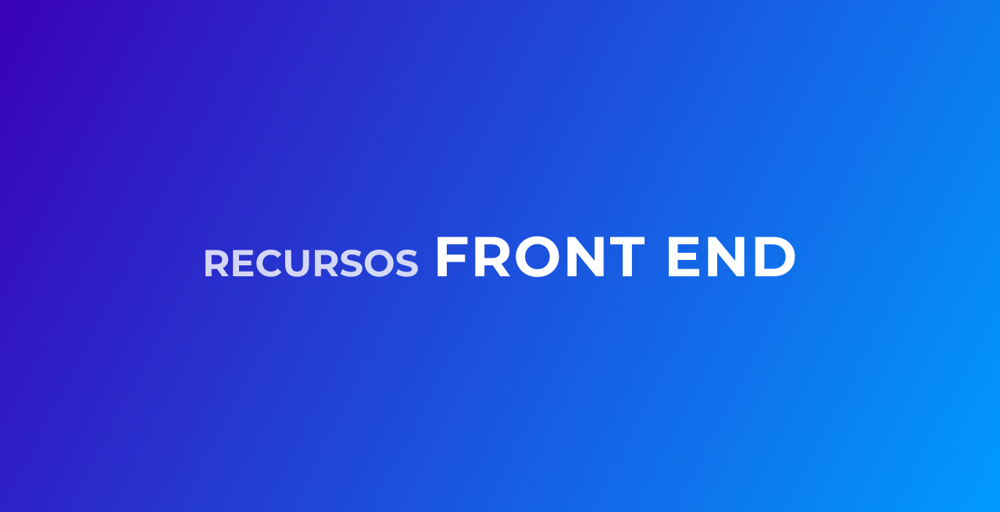

Este repositório reúne links úteis e recursos essenciais para desenvolvedores frontend. Aqui você encontrará referências de bibliotecas, frameworks, tutoriais, ferramentas, e dicas que podem agilizar e aprimorar seu trabalho no desenvolvimento de interfaces. O objetivo é ser uma fonte prática de consulta para facilitar o aprendizado e o desenvolvimento de soluções frontend.

Contribuições são bem-vindas! Se você conhece um recurso interessante, sinta-se à vontade para abrir um pull request.

## Indice

* [Avatares](#avatares)
* [Compartilhar fragmento de código](#compartilhar-fragmento-codigo)
* [Compressor de imagens](#compressor-imagens)
* [Cores](#cores)
* [CSS](#css)
* [Desafios](#desafios)
* [Design Systems](#design-systems)
* [Edição de imagens](#edicao-imagens)
* [Editor de Markdown](#editor-markdown)
* [Emoji](#emoji)
* [Extensões do Chrome](#extensoes-chrome)
* [Ferramentas](#ferramentas)
* [Fontes](#fontes)
* [Hospedagens](#hospedagens)
* [HTML](#html)
* [Ícones](#icones)
* [Ilustrações](#ilustracoes)
* [Imagens](#imagens)
* [Inspirações](#inspiracoes)
* [JavaScript](#javascript)
* [Minifier](#minifier)
* [Performance](#performance)
* [Placeholder](#placeholder)
* [Prototipação](#prototipacao)
* [Templates HTML/CSS](#templates-html-css)
* [Remove background](#remove-background)
* [UI Kits](#ui-kits)

### Avatares
Link | Descrição | Grátis |
|---|---|---|
| [Avatar Generator](https://getavataaars.com) | Gerador de avatar para qualquer um fazer seu avatar pessoal facilmente | Sim | Yes | No |
| [Random User Generator](https://randomuser.me) | API para gerar dados aleatórios de usuário | Sim | Yes | No |
| [Ui Faces](https://uifaces.co) | Plugin / API de avatar | Um mês | Yes | No |

**[⬆ Voltar para o indice](#indice)**

## Compartilhar fragmento de código
Link | Descrição | Grátis |
|---|---|---|
| [Carbon](https://carbon.now.sh/) | Crie e compartilhe belas imagens de seu código-fonte | Sim | Yes | No |
| [Ray](https://ray.so/) | Crie belas imagens do seu código! | Sim | Yes | No |

**[⬆ Voltar para o indice](#indice)**

## Compressor de imagens
Link | Descrição | Grátis |
|---|---|---|
| [TinyPNG](https://tinypng.com/) | Compressão inteligente de PNG e JPEG | Sim | Yes | No |
| [websiteplanet](https://www.websiteplanet.com/webtools/imagecompressor/) | Comprima seus arquivos PNG / JPG em até 80% e mantenha total transparência | Sim | Yes | No |
| [Squoosh](https://squoosh.app/) | Compressão de imagens para web em diversos formatos. | Sim | Yes | No |

**[⬆ Voltar para o indice](#indice)**

## Cores
Link | Descrição | Grátis |
|---|---|---|
| [0to255](https://www.0to255.com) | Ferramenta de cor que facilita o clareamento e o escurecimento das cores | Sim | Yes | No |
| [Adobe Color](https://color.adobe.com/pt/create/color-wheel) | Gerador de paleta de cores | Sim | Yes | No |
| [Brand Palettes](https://brandpalettes.com) | Códigos de cores e paletas do logotipo | Sim | Yes | No |
| [calcolor.co](https://calcolor.co/) | Crie paletas específicas para projetos e compartilhe-as com outras pessoas | Sim | Yes | No |
| [Color Hunt](https://colorhunt.co) | Plataforma para inspiração de cores com milhares de paletas de cores  | Sim | Yes | No |
| [Color.review](https://color.review) | Avalia contraste entre texto e background | Sim | Yes | No |
| [Color-hex](https://www.color-hex.com) | Fornece informações sobre cores, incluindo modelos de cores (RGB, HSL, HSV e CMYK) | Sim | Yes | No |
| [ColorKit](colorkit.io) | Gera escalas de cores misturando os tons entre duas cores  | Sim | Yes | No |
| [ColorsLol](https://colors.lol) | Paletas de cores excessivamente descritivas | Sim | Yes | No |
| [Colorsinspo](colorsinspo.com) | Paletas de cores que você pode usar diretamente com um clique | Sim | Yes | No |
| [ColorSuply](https://colorsupplyyy.com/app) | Um seletor de cores para designers e ilustradores | Sete visitas | Yes | No |
| [ColorZilla](https://www.colorzilla.com) | Um poderoso editor de gradiente CSS semelhante ao Photoshop da ColorZilla | Sim | Yes | No |
| [colourco.de](https://colourco.de) | Ferramenta de design online que permite combinar cores de forma fácil e intuitiva | Sim | Yes | No |
| [Contrast Ratio](https://contrast-ratio.com) | Indicador de contraste | Sim | Yes | No |
| [Coolors](https://coolors.co) | Crie a paleta perfeita ou inspire-se com milhares de belos esquemas de cores | Sim | Yes | No |
| [Culrs](https://www.culrs.com) | As cores que funcionam juntas são selecionadas e moldadas em paletas de qualidade que você pode incorporar | Sim | Yes | No |
| [Design Seeds](https://www.design-seeds.com) | Várias paletas de cores | Sim | Yes | No |
| [Flat Ui Colors](https://flatuicolors.com) | Um conjunto total de 280 cores está ao seu alcance para COPIAR / COLAR para seu próximo projeto, design, apresentação | Sim | Yes | No |
| [Khroma](http://khroma.co/) | Usa IA para aprender de quais cores você gosta e cria paletas ilimitadas para você descobrir, pesquisar e salvar | Sim | Yes | No |
| [Name that Color](https://chir.ag/projects/name-that-color/#6195ED) | Informa o nome da cor escolhida | Sim | Yes | No |
| [Paletton](http://paletton.com/#uid=1000u0kllllaFw0g0qFqFg0w0aF) | Projetado para ajudar todos os tipos de projetos coloridos, desde o trabalho profissional até os projetos escolares dos seus filhos | Sim | Yes | No |
| [Scheme Color](https://www.schemecolor.com) | Um site bem cotado para baixar, criar e compartilhar milhares de belas combinações de cores | Sim | Yes | No |
| [Tint and Shade Generator](https://maketintsandshades.com) | Crie facilmente tons e sombras que correspondam à saída do Chrome DevTools, PostCSS e Sass | Sim | Yes | No |
| [uiGradients](https://uigradients.com) | Uma coleção escolhida a dedo de lindos gradientes de cores para designers e desenvolvedores | Sim | Yes | No |
| [UI Colors](https://uicolors.app/) | Cria uma paleta de cores conforme a escala do TailwindCSS, pode exportar como JSON, SCSS e SVG. | Sim | Yes | No |

**[⬆ Voltar para o indice](#indice)**

## CSS
Link | Descrição | Grátis |
|---|---|---|
| [Animate.css](https://animate.style) | É uma biblioteca de animações prontas para uso em vários navegadores para uso em seus projetos da web. | Sim | Yes | No |
| [Animista](https://animista.net/) | É um lugar onde você pod e brincar com uma coleção de animações CSS pré feitas, e obter somente as que você vai usar de verdade. | Sim | Yes | No |
| [Autoprefixer](http://autoprefixer.github.io) | É um plugin PostCSS que analisa seu CSS e adiciona prefixos de fornecedores. | Sim | Yes | No |
| [Bestcssbutton](https://www.bestcssbuttongenerator.com/) | É uma ferramenta online gratuita que permite criar estilos de botões HTML e CSS para vários navegadores. | Sim | Yes | No |
| [Box Shadow CSS Generator](https://www.cssmatic.com/box-shadow) | É uma ferramenta online gratuita para gerar gradientes, border radius, noise texture e box shadow. | Sim | Yes | No |
| [Calculadora de especificidade CSS](https://specificity.keegan.st) | Uma maneira visual de entender a especificidade do CSS. Altere os seletores ou cole os seus. | Sim | Yes | No |
| [Can I Use](https://caniuse.com) | Fornece tabelas de suporte de navegador atualizadas para suporte de tecnologias front-end da web em navegadores de desktop e móveis. | Sim | Yes | No |
| [Clip-path converter](https://yoksel.github.io/relative-clip-path/) | O conversor está apenas preparando o caminho SVG para ser usado no caminho do clipe CSS. | Sim | Yes | No |
| [Contrast Ratio](https://contrast-ratio.com/) | Este texto de amostra tenta demonstrar visualmente como essa combinação de cores é legível, para texto normal, itálico, negrito ou negrito itálico de vários tamanhos e estilos de fonte. | Sim | Yes | No |
| [CSS clip-path maker](https://bennettfeely.com/clippy/) | A propriedade clip-path permite criar formas complexas em CSS, recortando um elemento em uma forma básica (círculo, elipse, polígono ou inserção) ou em uma fonte SVG. | Sim | Yes | No |
| [CSS Formatter](https://www.cleancss.com/css-beautify) | Formate seu CSS, HTML e Javascript para embelezar e limpar seu código para facilitar a leitura. | Sim | Yes | No |
| [CSS Gradient](https://cssgradient.io/?fbclid=IwAR0dQD8FCAVJAgzq9p-TgNZn9SkLXgoJrL41XOkzL7eETZ0f6NA7xpPJglo) | É um pequeno site feliz e uma ferramenta gratuita que permite criar um fundo gradiente para sites. | Sim | Yes | No |
| [CSS Layout](https://csslayout.io/) | Layouts e padrões populares feitos com CSS. Dependências zero. Sem frameworks. Sem Hacks CSS. Casos de uso reais. Boas práticas. | Sim | Yes | No |
| [CSS Validation Service](https://jigsaw.w3.org/css-validator) | Analisa folhas de estilo em cascata (CSS) e documentos (X)HTML com folha de estilo | Sim | Yes | No |
| [CSS3 generator](https://css3generator.com/) | Gerador de código CSS3. Border Radius. Box Shadow. Text Shadow. RGBA. Entre outros | Sim | Yes | No |
| [CSS typeset](http://csstypeset.com/index.htm) | É uma ferramenta prática de tipografia que permite que designers e desenvolvedores testem e aprendam interativamente como estilizar seu conteúdo da web. | Sim | Yes | No |
| [Cubic Bezier](https://cubic-bezier.com) | Gerador de Cubic-Bezier | Sim | Yes | No |
| [Pure CSS Components](https://css-components.felipefialho.com/) | Um conjunto de componentes de interface do usuário comuns usando o poder do CSS e sem Javascript. | Sim | Yes | No |
| [Easing functions](https://easings.net) | Easing functions, especificam a taxa de alteração de um parâmetro ao longo do tempo. Esta página ajuda você a escolher a função de atenuação correta. | Sim | Yes | No |
| [Fancy Border Radius](https://9elements.github.io/fancy-border-radius/) | Um gerador visual para construir formas de aparência orgânica com a ajuda da propriedade border-radius do CSS3. | Sim | Yes | No |
| [How To Center](http://howtocenterincss.com) | Centralizar em CSS é um pé no saco. Essa ferramenta os consolida e fornece o código de que você precisa para cada situação. | Sim | Yes | No |
| [HTML5 Canvas Tutorials](https://www.html5canvastutorials.com/) | Diversos tutoriais sobre os recursos do HTML5 e CSS3. | Sim | Yes | No |
| [Referência CSS da MDN](https://developer.mozilla.org/en-US/docs/Web/CSS/Reference) | Use esta referência CSS para navegar por um índice alfabético de todas as propriedades CSS padrão. | Sim | Yes | No |
| [Shape Divider](https://www.shapedivider.app) | Ferramenta gratuita para tornar mais fácil para designers e desenvolvedores exportar um belo SVG. | Sim | Yes | No |
| [The Echoplex Flexbox](https://the-echoplex.net/flexyboxes/) | Playground flexbox CSS online e gerador de código. | Sim | Yes | No |
| [Transition CSS](https://github.com/argyleink/transition.css) | Repositorio com diversas transações, usando CSS. | Sim | Yes | No |
| [Wait Animate](https://waitanimate.wstone.io/) | O Animate calcula as porcentagens de keyframe atualizadas com um tempo de espera, o que significa que você pode inserir um atraso entre cada iteração da animação usando CSS puro, sem JavaScript. | Sim | Yes | No |
| [Wow JS](https://wowjs.uk/docs) | É um plugin JavaScript que revela animações quando você rola. Muito amigo do Animate.css. | Sim | Yes | No |

**[⬆ Voltar para o indice](#indice)**

## Desafios
Link | Descrição | Grátis |
|---|---|---|
| [JavaScript30](https://javascript30.com/) | 30 desafios de JS. | Sim | Yes | No |
| [30 days CSS](https://30dayscss.vercel.app/challengesList) | 30 desafios de CSS. | Sim | Yes | No |
| [Ace Front-end](https://www.acefrontend.com/) | Ace Front End tem desafios de codificação completos e práticos, com um passeio detalhado de uma solução de entrevista perfeita. | Sim | Yes | No |
| [App Ideas](https://github.com/florinpop17/app-ideas) | Repositorio com diversos projetos separados por niveis. Esta não é apenas uma lista simples de projetos, mas uma coleção que descreve cada projeto em detalhes suficientes para que você possa desenvolvê-lo do zero. | Sim | Yes | No |
| [Codier](https://codier.io/) | Explore e tente desafios de codificação de front-end. | Sim | Yes | No |
| [Codewell](https://www.codewell.cc/) | Melhore suas habilidades em HTML e CSS praticando em modelos de design reais. | Sim | Yes | No |
| [CSS Battle](https://cssbattle.dev) | Use suas habilidades de CSS para replicar desafios com o menor código possível. | Sim | Yes | No |
| [DevChallenge](https://devchallenge.com.br) | Melhore suas habilidades com desafios de front-end, back-end e mobile. | Sim | Yes | No |
| [Edabit](https://edabit.com/challenges) | Nossos desafios pequenos são um atalho no labirinto de aprender a codificar. Ganhe XP, desbloqueie conquistas e suba de nível. Fique realmente bom em codificação, muito rápido. | Sim | Yes | No |
| [Front-end Challenges](https://github.com/felipefialho/frontend-challenges) | O principal objetivo do repositório é testar seu conhecimento usando o desafio de empregos reais. | Sim | Yes | No |
| [Frontend Mentor](https://www.frontendmentor.io/) | Resolva desafios reais de HTML, CSS e JavaScript enquanto trabalha com designs profissionais. Junte-se a 170.842 desenvolvedores que criam projetos, revisam códigos e ajudam uns aos outros a melhorar. | Sim | Yes | No |
| [JSBeginners](https://jsbeginners.com/) | Obtenha mais de 100 ótimas ideias para JavaScript iniciante | Sim | Yes | No |
| [JSchallenger](https://www.jschallenger.com/) | Desafios de Javascript grátis. Aprenda Javascript online resolvendo exercícios de codificação. Javascript para todos os níveis. Resolva tarefas Javascript do iniciante ao avançado. | Sim | Yes | No |
| [WoMakersCode Front-end Challenges](https://github.com/WoMakersCode/challenges-front-end) | Uma série de desafios e tutoriais sobre Desenvolvimento Front-end. | Sim | Yes | No |

**[⬆ Voltar para o indice](#indice)**

## Design Systems
Link | Descrição | Grátis |
|---|---|---|
| [Design System](https://designsystems.surf/design-systems) | Plataforma unificada contendo um banco de dados das diversas Ferramentas de Design atuais, organizado por sistemas, componentes, diretórios e blueprints. | Sim | Yes | No |

**[⬆ Voltar para o indice](#indice)**

## Hospedagens
Link | Descrição | Grátis |
|---|---|---|
| [000WebHost](https://br.000webhost.com/) | Hospedagem de Sites Grátis com PHP, MySQL, Criador de Sites grátis, cPanel e sem anúncios. Sua hospedagem de sites é quase ilimitada e com domínio. | Sim | Yes | No |
| [Github Pages](https://pages.github.com/) | Hospedado diretamente de seu repositório GitHub. Basta editar, enviar por push e suas alterações estarão ativas. | Sim | Yes | No |
| [Heroku](https://www.heroku.com/) | Heroku é uma plataforma como serviço (PaaS) que permite aos desenvolvedores construir, executar e operar aplicativos inteiramente na nuvem. | Não | Yes | No |
| [Fly](https://www.fly.io/) | Fly é uma plataforma como serviço (PaaS) para executar aplicações full stack e bancos de dados próximos a seus usuários. | Sim ou preço sob demanda conforme o consumo | Yes | No |
| [CloudFlare Pages](https://pages.cloudflare.com/) | Cloudflare Pages é uma plataforma JAMstack para desenvolvedores frontend para colaborar e implantar sites. | Sim ou planos de UD$ 20.00 e US$ 200.00 | Yes | No |
| [InfinityFree](https://infinityfree.net/) | Hospedagem de sites totalmente gratuita com espaço em disco e largura de banda ilimitados. | Sim | Yes | No |
| [Netlify](https://www.netlify.com/) | Um fluxo de trabalho intuitivo baseado em Git e uma plataforma sem servidor poderosa para construir, implantar e colaborar em aplicativos da web. | Sim | Yes | No |
| [Vercel](https://vercel.com/dashboard) | O Vercel combina a melhor experiência do desenvolvedor com um foco obsessivo no desempenho do usuário final. Nossa plataforma permite que as equipes de front-end façam seu melhor trabalho. | Sim | Yes | No |
| [Render](https://render.com/) | O Render é uma plataforma de hospedagem em nuvem que oferece serviços para implantar, dimensionar e gerenciar aplicativos e sites. Eles oferecem suporte a diversas linguagens de programação, frameworks e bancos de dados. | Sim ou preço sob demanda conforme o consumo | Yes | No |
| [Railway](https://railway.app/) | O Railway é uma plataforma que facilita a implantação e o gerenciamento de aplicativos da web e serviços back-end. Ele permite que os desenvolvedores publiquem seus aplicativos na nuvem de forma rápida e fácil, oferecendo suporte a uma variedade de tecnologias e frameworks populares. | Sim ou preço sob demanda conforme o consumo | Yes | No |

**[⬆ Voltar para o indice](#indice)**

## HTML
Link | Descrição | Grátis |
|---|---|---|
| [Dive Into HTML5](https://diveintohtml5.com.br) | Seleção de funcionalidades da especificação da HTML5 e outras especificações interessantes escolhidas a dedo. | Sim | Yes | No |
| [HTML5 Boilerplate](https://html5boilerplate.com) | Ajuda você a criar sites ou aplicativos da web rápidos, robustos e adaptáveis. | Sim | Yes | No |
| [Índice de elementos HTML](http://html5doctor.com/element-index) |Referência rápida de elementos que são novos ou foram redefinidos em HTML5. | Sim | Yes | No |
| [Referência HTML da MDN](https://developer.mozilla.org/pt-BR/docs/Web/HTML/Element) | Esta página lista todos os elementos HTML. Eles são agrupados por função para ajuda-lo a achar o que quer fácilmente. | Sim | Yes | No |
| [Validador de código HTML](https://validator.w3.org) | Este validador verifica a validade da marcação de documentos da Web em HTML, XHTML, SMIL, MathML, etc. | Sim | Yes | No |

**[⬆ Voltar para o indice](#indice)**

## Ícones
Link | Descrição | Grátis |
|---|---|---|
| [Boxicons](https://boxicons.com/) | Ícones simples de vetor cuidadosamente elaborados para designers e desenvolvedores. | Sim | Yes | No |
| [CSS GG](https://css.gg/) | Ícones de interface de usuário CSS, SVG e Figma de código aberto. Disponível em SVG Sprite, componentes estilizados, NPM e API. | Sim | Yes | No |
| [Eva Icons](https://akveo.github.io/eva-icons/) | Eva Icons é um pacote de mais de 480 ícones Open Source lindamente elaborados para ações e itens comuns. | Sim | Yes | No |
| [Favicon Generator](https://realfavicongenerator.net) | Gere todos os ícones de que você precisa para navegadores de desktop, iPhone / iPad, dispositivos Android, dispositivos Windows 8 e muito mais. | Sim | Yes | No |
| [Feather](https://feathericons.com/) | Ícones de código aberto simplesmente lindos | Sim | Yes | No |
| [Flaticon](https://www.flaticon.com) | Baixe gratuitamente ícones vetoriais e adesivos para seus projetos. Recursos feitos por e para designers. Formatos PNG, SVG, EPS, PSD e BASE 64. | Sim | Yes | No |
| [Font Awesome](https://fontawesome.com) | Obtenha ícones vetoriais e logotipos sociais em seu site com Font Awesome, o conjunto de ícones e kit de ferramentas mais popular da web. | Sim | Yes | No |
| [Free icons](https://freeicons.io) | A maior base de dados de ícones gratuitos, disponível nos formatos PNG, SVG, EPS, PSD e BASE 64. | Sim | Yes | No |
| [Freepik](https://br.freepik.com/) | Recursos gráficos para todos encontre Vetores, PSD e Fotos gratis | Sim | Yes | No |
| [Heroicons](https://heroicons.dev/) | Um conjunto de mais de 450 ícones SVG gratuitos de alta qualidade licenciados pelo MIT para você usar em seus projetos da web. Disponível como ícones SVG básicos e por meio das bibliotecas React e Vue originais. | Sim | Yes | No |
| [Icon Icons](https://icon-icons.com/) | Melhores ícones gratuitos para uso pessoal e comercial SVG - PNG | Sim | Yes | No |
| [Icon Finder](https://www.iconfinder.com/free_icons) | O Iconfinder é o maior mercado do mundo para ícones vetoriais e raster nos formatos SVG e PNG. | Sim | Yes | No |
| [Icon Moon](https://icomoon.io) | IcoMoon fornece um pacote de ícones vetoriais, junto com um aplicativo HTML5 gratuito para fazer fontes de ícone personalizadas ou sprites SVG. | Plano Grátis, Plano Básico, Plano Ilimitado. | Yes | No |
| [Icons8](https://icons8.com.br) | Baixe gratuitamente elementos de design: ícones, fotos, ilustrações de UX para seus projetos. | Sim | Yes | No |
| [Icons Cout](https://iconscout.com/) | SVGs selecionados, ícones vetoriais, ilustrações, gráficos 3D e animações Lottie. Mais de 3.000 ativos adicionados todos os dias.  | Sim | Yes | No |
| [Icon SVG](https://iconsvg.xyz/) | Ícones personalizáveis rápidos para seus projetos | Sim | Yes | No |
| [Ikonate](https://ikonate.com/) | Ferramenta simples para localizar, personalizar e gerar ícones SVG comuns para o seu projeto. | Sim | Yes | No |
| [Ion Icons](https://ionicons.com/) | Ícones projetados para uso em aplicativos da web, iOS, Android e desktop. Suporte para SVG e fonte da web. | Sim | Yes | No |
| [Line Awesome](https://icons8.com/line-awesome) | Swap Font Awesome para ícones de linha modernos em uma linha de código. | Sim | Yes | No |
| [Newsbi Icon Pack](https://gumroad.com/l/lfdy) | Faça o design de maneira mais inteligente. Recursos de UI de classe mundial para economizar custos e ajudar a construir seu produto com mais rapidez. | Sim | Yes | No |
| [Noun Project](https://thenounproject.com) | Apresenta a coleção mais diversa de ícones e fotos de todos os tempos. Baixe SVG e PNG. | Sim | Yes | No |
| [Pixelart Icons](https://pixelarticons.com/) | Mais de 350 ícones de estilo pixel art de código aberto, em uma cor e feitos com uma grade de 24x24px. | Sim | Yes | No |
| [Radix Icons](https://icons.modulz.app) | Um conjunto nítido de 15 × 15 ícones projetados pela equipe Modulz. | Sim | Yes | No |
| [Remix Icon](https://remixicon.com/) | É um conjunto de símbolos de sistema de estilo neutro de código aberto elaboradamente elaborado para designers e desenvolvedores. Todos os ícones são gratuitos para uso pessoal e comercial. | Sim | Yes | No |
| [Shape SO](https://shape.so/) | Shape permite que você personalize o estilo, as cores e as bordas de ícones e ilustrações estáticos e animados. | Sim | Yes | No |
| [Simple Icons](https://simpleicons.org/) | 1978 Ícones SVG gratuitos para marcas populares. | Sim | Yes | No |
| [Steamline Free](https://www.streamlineicons.com/free/) | 100.000 ícones, ilustrações e emoji para todos os seus projetos. Personalize-os de acordo com sua marca em segundos. | Plano Gratuito, Plano All icons, Plano All Illustrations, Plano Super Bundle | Yes | No |
| [SVG Icons](http://svgicons.sparkk.fr/) | Escolha um ícone. Tudo que você precisa fazer é copiar e colar o código HTML. | Sim | Yes | No |
| [Tabler Icons](https://tablericons.com/) | 1280 Ícones SVG gratuitos totalmente personalizáveis. (Licença MIT). | Sim | Yes | No |
| [Tilda Icons](https://tilda.cc/free-icons/) | Baixe gratuitamente ícones SVG e use-os em seus projetos. Não se esqueça de vincular de volta à fonte. | Sim | Yes | No |
| [Lucide](https://lucide.dev/) | Lucide Icons é uma coleção de ícones de código aberto, com suporte para vários frameworks, incluindo Vue.js, React, Svelte, Preact e Angular.   | Sim | Yes | No |
**[⬆ Voltar para o indice](#indice)**

## <a name="ilustracoes"><a/>Ilustrações
Link | Descrição | Grátis |
|---|---|---|
| [3000 Hands](https://www.shapefest.com/expansions/3000-hands) | Uma enorme biblioteca gratuita de formas 3D lindamente renderizadas. | Sim | Yes | No |
| [404 illustrations](https://www.kapwing.com/404-illustrations) | Imagens modernas e prontas para usar na sua página 404. | Sim | Yes | No |
| [404 illustrations Fun](https://error404.fun/) | Faça uma viagem única pelas páginas de erro 404 em seu site. Use essas ilustrações que descrevem melhor do que palavras. | Sim | Yes | No |
| [Abstrakt](https://www.abstrakt.design/) | Baixe nossas ilustrações abstratas gratuitas e premium para sua próxima página de destino, aplicativo móvel e apresentação. | Sim / 20€ Mês. | Yes | No |
| [Absurd Design](https://absurd.design/) | Que tal ilustrações absurdas para seus projetos? Leve cada usuário em uma jornada individual através de sua própria imaginação. | Sim | Yes | No |
| [Ara Illustration](https://www.aracreator.com/) | Crie suas próprias composições de cena de ilustração. Obtenha o Ara gratuitamente com licenças pessoais e comerciais | Sim | Yes | No |
| [Black illustrations](https://www.blackillustrations.com) | De seus sites, aplicativos da web a aplicativos móveis, criamos esses designs para serem usados em qualquer lugar. | Sim / O preço das ilustrações pode variar.| Yes | No |
| [Blob Marker](https://www.blobmaker.app/) | É uma ferramenta de design generativa gratuita feita para ajudá-lo a criar rapidamente formas SVG aleatórias, exclusivas e com aparência orgânica. | Sim | Yes | No |
| [Blush](https://blush.design/) | Crie e personalize facilmente ilustrações impressionantes com coleções feitas por artistas de todo o mundo. | Sim / $ 12 Mês. | Yes | No |
| [Construtor de Ilustrações](https://itg.digital/) | Crie ilustrações personalizadas com apenas alguns cliques usando nosso construtor online. | Sim | Yes | No |
| [Control](https://control.rocks) | Uma grande biblioteca de ilustrações com estilo e tipos de ação personalizáveis. Use o construtor para criar a cena que você está procurando. | Sim / $38 mês ou $89 trimestral. | Yes | No |
| [Delesign](https://delesign.com/) | Use nossos designs livres de royalties para seu site, mídia social, blog, boletins informativos por e-mail e muito mais. | Sim | Yes | No |
| [Design.ai](https://designs.ai/graphicmaker/) | Ilustrações editáveis em cores gratuitas para elevar suas comunicações visuais. | Sim | Yes | No |
| [DrawKit](https://www.drawkit.io) | Recursos de ícones e ilustração vetorial desenhada à mão, perfeitos para o seu próximo projeto. | Sim | Yes | No |
| [Flow Lava](https://flowlava.club) | Crie um projeto atraente e único com personagens futuristas por um construtor fácil de usar. | Sim / 89$ Trimestre | Yes | No |
| [Frellustrations](https://freellustrations.com/) | Coleção de imagens de fundo de ilustrações ou vetores de alta resolução para sites e páginas de destino modernos. | Sim | Yes | No |
| [Fresh Folk](https://fresh-folk.com/) | Uma biblioteca de ilustração de pessoas e objetos. | Sim | Yes | No |
| [Get Waves](https://getwaves.io/) | Um gerador de ondas SVG gratuito para criar ondas SVG exclusivas para o seu próximo design da web. Escolha uma curva, ajuste a complexidade, randomize. | Sim | Yes | No |
| [Get Illustrations](https://www.getillustrations.com/illustration-packs/freebie) | Crie uma biblioteca de ilustrações de integração para seu próximo projeto. | Sim | Yes | No |
| [Glaze](https://www.glazestock.com/) | Produtos, marcas e apresentações memoráveis começam com nosso biblioteca de ilustração royalty-free com curadoria. | Sim | Yes | No |
| [Growww](https://growwwkit.com/illustrations/phonies/) | Um conjunto de 8 ilustrações simples, em preto e branco e elegantes para páginas de destino, telas de dispositivos móveis e outros fins editoriais. | Sim | Yes | No |
| [Humaaans](https://www.humaaans.com/) | Misture e combine ilustrações de pessoas com uma biblioteca de design. | Sim | Yes | No |
| [Illustrations](https://illlustrations.co/) | Você pode baixar todas as ilustrações gratuitamente e usá-las para criar um design incrível - páginas de destino, aplicativos móveis ou apresentações. | Sim | Yes | No |
| [IRA Design](https://iradesign.io/) | Usando nossos gradientes impressionantes e componentes de esboço desenhados à mão. | Sim | Yes | No |
| [Karthik Srinivas](https://www.karthiksrinivas.in/illustrations) | Diversas ilustrações e icones para você usar em seus projetos. | Sim | Yes | No |
| [Kukla Kit](https://kukla-kit.wannathis.one/) | Pacote enorme de elementos 3D acessíveis diretamente do Figma. | Sim | Yes | No |
| [Logo Maker](https://www.brandcrowd.com/) | Crie um cartão de visita deslumbrante em minutos. Navegue por milhares de designs com curadoria profissional e edite-os com nosso criador de cartões de visita. | Sim | Yes | No |
| [Lukasadam](https://lukaszadam.com/illustrations) | Gratuito para uso comercial e pessoal sob a licença CC0 (licença MIT). Nenhuma atribuição necessária. | Sim | Yes | No |
| [Manypixels Illustration Gallery](https://www.manypixels.co/gallery/) | Descubra novas ilustrações todas as semanas. Use-os nas páginas de destino, postagens de blogs, boletins informativos, gráficos de mídia social.| Sim | Yes | No |
| [Mega Doodles Pack](https://github.com/MariaLetta/mega-doodles-pack) | Esta é uma coleção de ilustrações vetoriais desenhadas à mão. Mais de 160 elementos de doodle (nuvens, cactos, estrelas, monstros, donuts, foguetes, pizzas, corações, tênis, lápis, diamantes, gatos, mãos, arco-íris, flechas, telefones celulares, etc). | Sim | Yes | No |
| [Mixkit Art](https://mixkit.co/free-stock-art/) | Belas Artes e Ilustração para você usar em seu próximo projeto criativo, de graça. | Sim | Yes | No |
| [Open Doodles](https://www.opendoodles.com/) | Uma biblioteca de ilustrações esboçadas de pessoas, gratuita para uso pessoal e comercial. | Sim | Yes | No |
| [Open Peeps](https://www.openpeeps.com/) | É uma biblioteca de ilustração desenhada à mão para criar cenas de pessoas. | Sim | Yes | No |
| [Ouch](https://icons8.com/illustrations) | Ilustrações grátis para melhorar o seu projeto Ouch ajuda os criadores que não sabem desenhar a superar a falta de gráficos de qualidade. | Sim | Yes | No |
| [Paper Illustrations](https://iconscout.com/paper-illustrations) | Faça seu trabalho se destacar com ilustrações em papel conjunto incrível de ilustrações em papel absolutamente grátis para uso pessoal e comercial. | Sim | Yes | No |
| [Sapiens](https://sapiens.ui8.net/) | É uma bela biblioteca de ilustrações modulares de personagens baseadas em componentes para Sketch e Figma. | Sim | Yes | No |
| [Scribbles](https://www.scribbbles.design/) | Mais de 100 rabiscos vetorizados para apimentar seus projetos de design. | Sim | Yes | No |
| [Smash Illustrations](https://usesmash.com/) | Ilustração incrível construtor com colorido e personagens da moda. | Sim | Yes | No |
| [Story Set](https://storyset.com) | Ilustrações personalizáveis gratuitas incríveis para seu próximo projeto personalize, anime e baixe nossas ilustrações para criar páginas de destino, aplicativos ou apresentações. | Sim | Yes | No |
| [Storytale](https://storytale.io) | Ilustrações da web de alta qualidade com assinatura simples use essas ilustrações para dar vida aos seus sites, aplicativos e apresentações. | Sim | Yes | No |
| [Stubborn Generator](https://stubborn.fun/) | Crie seu personagem ideal, alterando e sobrepondo-os, usando nosso gerador absolutamente de graça. | Sim | Yes | No |
| [Toy Faces](https://amritpaldesign.com/toy-faces) | É uma biblioteca divertida e diversificada de avatares 3D para seus modelos de design e projetos comerciais. | Sim | Yes | No |
| [Undraw](https://undraw.co/illustrations) | Navegue para encontrar as imagens que atendem às suas necessidades. Use a geração instantânea de imagens coloridas para combinar com a identidade de sua marca. | Sim | Yes | No |
| [Vector Creator](https://icons8.com/vector-creator/) | Maneiras ilimitadas de criar designs incríveis para cada necessidade. | Sim | Yes | No |
| [Whoosh! Illustration Kit](https://www.ls.graphics/illustrations/whoosh) | A mais alta qualidade Mockups, ilustrações e ferramentas de interface do usuário. | Sim / O preço das ilustrações pode variar.| Yes | No |

**[⬆ Voltar para o indice](#indice)**

## Edição de Imagens
Link | Descrição | Grátis |
|---|---|---|
| [Photopea](https://www.photopea.com/) | O Online Photo Editor permite editar fotos, aplicar efeitos, filtros, adicionar texto, cortar ou redimensionar imagens. | Sim | Yes | No |
| [Canva](https://www.canva.com/) | Uma plataforma de design gráfico que permite aos usuários criar gráficos de mídia social, apresentações, infográficos, pôsteres e outros conteúdos visuais.  | Sim | Yes | No |

**[⬆ Voltar para o indice](#indice)**

## Editor de Markdown
Link | Descrição | Grátis |
|---|---|---|
| [StackEdit](https://stackedit.io) | Você pode sincronizar seus arquivos com o Google Drive, Dropbox e GitHub. Ele também pode publicá-los como postagens de blog no Blogger, WordPress e Zendesk. | Sim | Yes | No |
| [Typora](https://typora.io/) | Ele remove a janela de visualização, o alternador de modo, os símbolos de sintaxe do código-fonte do markdown. E fornece um recurso de visualização ao vivo. | Sim | Yes | No |

**[⬆ Voltar para o indice](#indice)**

## Emoji
Link | Descrição | Grátis |
|---|---|---|
| [Get Emoji](https://getemoji.com/) | Copie e cole emojis para Twitter, Facebook, Slack, Instagram, Snapchat, Slack, GitHub, Instagram, WhatsApp e muito mais. | Sim | Yes | No |
| [Emojipedia](https://emojipedia.org/) | O mecanismo de pesquisa de emoji. Uma experiência de pesquisa rápida de emoji com opções para navegar por cada emoji por nome, categoria ou plataforma. | Sim | Yes | No |

**[⬆ Voltar para o indice](#indice)**

## Extensões do Chrome
Link | Descrição | Grátis |
|---|---|---|
| [axe - Web-Acessibility-Testing](https://chrome.google.com/webstore/detail/axe-web-accessibility-tes/lhdoppojpmngadmnindnejefpokejbdd/related?hl=en) | Encontre e corrija problemas de acessibilidade em seu site usando a extensão ax DevTools Chrome. | Sim | Yes | No |
| [ColorZilla](https://chrome.google.com/webstore/detail/colorzilla/bhlhnicpbhignbdhedgjhgdocnmhomnp?hl=pt-BR) | Conta-gotas avançada, seletor de cores, gerador de gradiente e outras guloseimas coloridas. | Sim | Yes | No |
| [Fonts Ninja](https://chrome.google.com/webstore/detail/fonts-ninja/eljapbgkmlngdpckoiiibecpemleclhh?hl=pt-BR) | Identifique fontes de qualquer site da Web, marque, experimente e compre-as. | Sim | Yes | No |
| [GoFullPage](https://chrome.google.com/webstore/detail/gofullpage-full-page-scre/fdpohaocaechififmbbbbbknoalclacl?hl=pt-BR) | Capture uma screenshot de sua página atual inteira sem solicitar nenhuma permissão extra! | Sim | Yes | No |
| [JSON Viewer](https://chrome.google.com/webstore/detail/json-viewer/gbmdgpbipfallnflgajpaliibnhdgobh?hl=pt-BR) | O iluminador JSON / JSONP mais bonito e personalizável que seus olhos já viram, extensão do Chrome para imprimir JSON e JSONP. | Sim | Yes | No |
| [Picture-in-Picture Extension](https://lnkd.in/eP6nwSu) | Permite que você assista a vídeos em uma janela flutuante (sempre em cima das outras janelas) para que você possa ficar de olho no que está assistindo enquanto interage com outros sites ou aplicativos. | Sim | Yes | No |
| [Page Ruler](https://chrome.google.com/webstore/detail/page-ruler/jcbmcnpepaddcedmjdcmhbekjhbfnlff?hl=pt-BR) | Uma régua do Web Developer \ Designer para obter dimensões em pixels e posicionamento para medir os elementos em qualquer página da web. | Sim | Yes | No |
| [Site Palette](https://chrome.google.com/webstore/detail/site-palette/pekhihjiehdafocefoimckjpbkegknoh) | Extraia cores de qualquer site, extensão que gera paletas de cores. Escolha cores para qualquer site. | Sim | Yes | No |
| [Web Developer](https://chrome.google.com/webstore/detail/web-developer/bfbameneiokkgbdmiekhjnmfkcnldhhm?hl=pt-BR) | Adiciona um botão da barra de ferramentas com várias ferramentas de desenvolvedor da web. | Sim | Yes | No |
| [WhatFont](https://chrome.google.com/webstore/detail/whatfont/jabopobgcpjmedljpbcaablpmlmfcogm?hl=pt-BR) | Com essa extensão, você pode inspecionar as fontes da web apenas passando o mouse sobre elas. | Sim | Yes | No |
| [Wappalyzer](https://chrome.google.com/webstore/detail/wappalyzer/gppongmhjkpfnbhagpmjfkannfbllamg?hl=pt-BR) | Wappalyzer é um utilitário de plataforma cruzada que descobre as tecnologias usadas em sites. Ele detecta sistemas de gerenciamento de conteúdo, plataformas de comércio eletrônico, estruturas da web, software de servidor, ferramentas de análise e muito mais. | Sim | Yes | No |
| [AdobeXD Rem fix](https://chrome.google.com/webstore/detail/adobe-xd-rem-fix/dppocgklbdkbfneadpfbodohoopacpdf?hl=pt-BR) | Exiba automaticamente a conversão dos valores PX para REM e Tailwind nos links de desenvolvimento gerados pelo AdobeXD. | Sim | Yes | No |

**[⬆ Voltar para o indice](#indice)**

## Ferramentas
Link | Descrição | Grátis |
|---|---|---|
| [Transform Tools](https://transform.tools/) | Um conversor de formatos poliglota | Sim  | Yes | No |
| [SVG 2 JSX](https://svg2jsx.com/) | Converte seu arquivo SVG num componente React. | Sim | Yes | No |

**[⬆ Voltar para o indice](#indice)**

## Fontes
Link | Descrição | Grátis |
|---|---|---|
| [Adobe Fonts](https://fonts.adobe.com) | Fontes ilimitadas. Escolha quantas precisar entre milhares de opções. Sem custo adicional. Todas as fontes estão incluídas em sua associação à Creative Cloud. | Sim | Yes | No |
| [CSS Font Stack](https://www.cssfontstack.com) | Pilhas de fontes CSS seguras para a Web e fontes da Web. Selecione, visualize e gere CSS e HTML para sua família de fontes. | Sim | Yes | No |
| [Font Combinations](https://www.canva.com/font-combinations) | Explicamos os fundamentos da escolha de ótimas fontes. Também fornecemos alguns dos melhores pares de fontes para usar em seu próximo design, bem como modelos com os quais você pode brincar usando os pares de fontes mencionados. | Sim | Yes | No |
| [FontPair](https://fontpair.co) | Pares de fontes do Google gratuitos para seu próximo projeto criativo | Sim | Yes | No |
| [FontSquirrel](https://www.fontsquirrel.com) | Sabemos como é difícil encontrar freeware de qualidade licenciado para uso comercial. Selecionamos manualmente essas fontes e apresentando-as em um formato fácil de usar. | Sim | Yes | No |
| [Google Fonts](https://fonts.google.com) | Tornando a web mais bonita, rápida e aberta por meio de uma ótima tipografia. | Sim | Yes | No |
| [Just My Type](https://justmytype.co) | Uma coleção de pares de fontes do Typekit e H&FJ. | Sim | Yes | No |
| [Modular Scale](https://www.modularscale.com) | As escalas modulares multifilamentares são poderosas porque adicionam mais números à sua escala. | Sim | Yes | No |
| [Transfonter](https://transfonter.org) | Esta ferramenta converte qualquer fonte TTF, OTF, WOFF, WOFF2 ou SVG em formatos css @ font-face com arquivos de amostra CSS e HTML. | Sim | Yes | No |
| [Typechem](https://typechem.herokuapp.com) | Typechem é uma coleção de fontes escolhidas a dedo e pares de cores. | Sim | Yes | No |
| [Systemfontstack](https://systemfontstack.com/) | Graças à criação e compra de fontes pela Apple, Microsoft, Google e outras pessoas, a maioria dos computadores tem boas - não, ótimo - fontes instaladas e são uma ótima opção se você não quiser carregar uma fonte separada. | Sim | Yes | No |
| [Fonts In Use](https://fontsinuse.com/) | Um arquivo pesquisável de design tipográfico, indexado por tipo de letra, formato e tópico. | Sim | Yes | No |

**[⬆ Voltar para o indice](#indice)**

## Inspirações
Link | Descrição | Grátis |
|---|---|---|
| [Awwwards](https://www.awwwards.com/) | Awwwards são os Website Awards que reconhecem e promovem o talento e esforço dos melhores desenvolvedores, designers e agências da web do mundo. | Sim | Yes | No |
| [abduzeedo](https://abduzeedo.com) | Um coletivo de escritores individuais que compartilham artigos sobre design, fotografia e experiência do usuário, bem como tutoriais para Photoshop e outras ferramentas. | Sim | Yes | No |
| [Best Website Gallery](https://bestwebsite.gallery) | Os mais belos sites escolhidos a dedo para você. | Sim | Yes | No |
| [CollectUI](https://collectui.com) | Inspiração diária coletada do arquivo daily ui. Baseado em fotos do Dribbble, escolhidas a dedo e atualizadas diariamente. | Sim | Yes | No |
| [Commercecream.com](https://commercecream.com) | Coletamos e destacamos as mais belas experiências de comércio no Shopify para ajudar a inspirar designers, desenvolvedores e comerciantes a criar coisas incríveis. | Sim | Yes | No |
| [Css Nectar](https://cssnectar.com) | Uma vitrine de design de sites css para web designers e desenvolvedores. Todos os dias selecionamos o melhor do web design e adicionamos em nossa galeria. | Sim | Yes | No |
| [Dribbble](https://dribbble.com) | É o principal destino para encontrar e exibir trabalhos criativos e lar dos melhores profissionais de design do mundo. | Sim | Yes | No |
| [ecomm.design](https://ecomm.design/) | Navegue por nossa coleção dos principais 3194 sites de comércio eletrônico por plataforma, categorias, tecnologias e tráfego. | Sim | Yes | No |
| [Httpster](https://httpster.net/2020/apr/) | É um recurso de inspiração que mostra sites totalmente arrasadores feitos por pessoas de todo o mundo. | Sim | Yes | No |
| [interfacely](https://www.instagram.com/interfacely/) | Os melhores designs de UI / UX do mundo com GUIAS! | Sim | Yes | No |
| [Land-book](https://land-book.com) | Galeria de designs com os melhores e mais cuidadosos websites. Ajudamos os criativos a encontrar inspiração e motivação para fazer coisas radicais. | Sim | Yes | No |

**[⬆ Voltar para o indice](#indice)**

## JavaScript
Link | Descrição | Grátis |
|---|---|---|
| [Animate On Scroll](https://michalsnik.github.io/aos) | Biblioteca de animação de scroll. | Sim | Yes | No |
| [Anime JS](https://animejs.com/) | É uma biblioteca de animação JavaScript leve com uma API simples. Funciona com propriedades CSS, SVG, atributos DOM e Objetos JavaScript. | Sim | Yes | No |
| [GreenSock](https://greensock.com/gsap) | É uma biblioteca de animação JavaScript padrão da GreenSock que permite criar animações de alto desempenho que funcionam em todos os principais navegadores. | Sim | Yes | No |
| [Immediately Invoked Function Expression (IIFE)](http://benalman.com/news/2010/11/immediately-invoked-function-expression/) | Blog post sobre, Expressão de Função Imediatamente Invocada (IIFE) | Sim | Yes | No |
| [Lightbox](https://lokeshdhakar.com/projects/lightbox2/) | É uma pequena biblioteca javascript usada para sobrepor imagens na parte superior da página atual. É fácil de configurar e funciona em todos os navegadores modernos. | Sim | Yes | No |
| [Micro JS](http://microjs.com/) | Conjunto de microestruturas. Microestruturas são definitivamente o canivete do mundo da biblioteca JavaScript: curto, doce, direto ao ponto. E com 5k ou menos. | Sim | Yes | No |
| [Dinero.js](https://dinerojs.com/) | É uma biblioteca open source para trabalhar com valores monetários no JavaScript. | Sim | Yes | No |
| [Date-fns](https://date-fns.org/) | É um pacote open source tendo um conjunto de ferramentas mais abrangente, porém simples e consistente para manipulação de datas no JavaScript. | Sim | Yes | No |
| [Moment JS](https://momentjs.com) | É um pacote open source que pode ser utilizado para validar, manipular e fazer o parse de datas no JavaScript. | Sim | Yes | No |
| [Move JS](https://github.com/visionmedia/move.js) | É uma pequena biblioteca JavaScript que torna a animação apoiada em CSS3 extremamente simples e elegante. | Sim | Yes | No |
| [Moving Letters](https://tobiasahlin.com/moving-letters/) | Texto animado com JavaScript e anime.js. | Sim | Yes | No |
| [Owl Carousel](https://owlcarousel2.github.io/OwlCarousel2/) | Plugin jQuery habilitado para toque que permite criar um lindo slider de carrossel responsivo. | Sim | Yes | No |
| [Parallax](https://matthew.wagerfield.com/parallax/) | Parallax.js reage à orientação do seu dispositivo inteligente, deslocando camadas dependendo de sua profundidade dentro de uma cena.| Sim | Yes | No |
| [Particles JS](https://vincentgarreau.com/particles.js/) | Uma biblioteca JavaScript leve para a criação de partículas. | Sim | Yes | No |
| [Eventos JavaScript](https://developer.mozilla.org/pt-BR/docs/Web/Events) | Referência de eventos no JavaScript.| Sim | Yes | No |
| [Referência JavaScript](https://developer.mozilla.org/pt-BR/docs/Web/JavaScript/Reference) | Referencia JavaScript, escrito por MDN. | Sim | Yes | No |
| [Regex 101](https://regex101.com) | Testador de expressão regular com destaque de sintaxe, explicação, folha de dicas para PHP / PCRE, Python, GO, JavaScript, Java. Apresenta um questionário e biblioteca de regex. | Sim | Yes | No |
| [Rellax JS](https://dixonandmoe.com/rellax/) | Rellax é uma biblioteca paralaxe javascript suave e superleve. | Sim | Yes | No |
| [Scroll Magic](https://scrollmagic.io/) | Ajuda você a reagir facilmente à posição de rolagem atual do usuário. | Sim | Yes | No |
| [Skrollr](https://prinzhorn.github.io/skrollr/) | É uma biblioteca de animação de rolagem completa. Na verdade, você pode usá-lo e ainda não ter nenhuma rolagem de paralaxe. Skrollr aproveita HTML5 e CSS3. | Sim | Yes | No |
| [SlickSlider](https://kenwheeler.github.io/slick/) | É uma biblioteca de carrossel. | Sim | Yes | No |
| [Swiper](https://swiperjs.com) | É o controle deslizante móvel mais moderno e gratuito com transições aceleradas por hardware e comportamento nativo incrível. Destina-se a ser usado em sites móveis, aplicativos da web móveis e aplicativos nativos / híbridos móveis. | Sim | Yes | No |
| [Three JS](https://threejs.org) | É uma biblioteca 3D de propósito geral fácil de usar, leve e compatível com vários navegadores.  | Sim | Yes | No |
| [Typed JS](https://mattboldt.com/demos/typed-js/) | É uma biblioteca que digita. Insira qualquer string e observe-a digitar na velocidade que você configurou, retroceda o que foi digitado e comece uma nova frase para quantas strings você configurou. | Sim | Yes | No |
| [T-writter JS](https://chriscavs.github.io/t-writer-demo/) | É uma biblioteca de efeito de máquina de escrever nativa. | Sim | Yes | No |
| [Velocity JS](http://velocityjs.org/) | É um mecanismo de animação com a mesma API do $ .animate () do jQuery. Funciona com e sem jQuery. | Sim | Yes | No |
| [Vivus JS](https://maxwellito.github.io/vivus) | É uma classe JavaScript leve (sem dependências) que permite animar SVGs, dando-lhes a aparência de estarem desenhados. | Sim | Yes | No |
| [Waypoints](http://imakewebthings.com/waypoints/) | É a maneira mais fácil de acionar uma função ao rolar para um elemento. | Sim | Yes | No |
| [You might not need jQuery](http://youmightnotneedjquery.com/) | O jQuery e seus primos são ótimos e, sem dúvida, use-os para facilitar o desenvolvimento de seu aplicativo. | Sim | Yes | No |

**[⬆ Voltar para o indice](#indice)**

## Minifier
Link | Descrição | Grátis |
|---|---|---|
| [HTML Minifier](https://kangax.github.io/html-minifier) | Ferramenta gratuita baseada na web para reduzir HTML e qualquer CSS ou JS incluído em sua marcação. | Sim | Yes | No |
| [CSSNANO](https://cssnano.co/) | O cssnano pega seu CSS bem formatado e o executa por meio de muitas otimizações específicas, para garantir que o resultado final seja o menor possível para um ambiente de produção. | Sim | Yes | No |
| [CSSO](http://css.github.io/csso/csso.html) | É um minificador CSS. Ele executa três tipos de transformações: limpeza, compactação e reestruturação. Como resultado, seu CSS se torna muito menor. | Sim | Yes | No |
| [UglifyJS 3](https://skalman.github.io/UglifyJS-online/) | É uma excelente ferramenta para ajudá-lo a minimizar seu JavaScript! É uma ferramenta testada e comprovada, usada por bibliotecas como o jQuery. | Sim | Yes | No |

**[⬆ Voltar para o indice](#indice)**

## Performance
Link | Descrição | Grátis |
|---|---|---|
| [GTmetrix](https://gtmetrix.com) | Veja o desempenho do seu site, revele por que ele está lento e descubra oportunidades de otimização. | Sim | Yes | No |
| [Image Analysis Tool](https://webspeedtest.cloudinary.com) | Descubra como as alterações no tamanho da imagem, seleção de formato, qualidade e codificação podem melhorar drasticamente a velocidade de carregamento da página. | Sim | Yes | No |
| [PageSpeed Insight](https://developers.google.com/speed/pagespeed/insights/?hl=pt-br) | Google PageSpeed é uma família de ferramentas da Google Inc, projetada para ajudar nas otimizações de desempenho de um site. | Sim | Yes | No |
| [WebPagetest](https://www.webpagetest.org) | Execute um teste de velocidade de site gratuito em todo o mundo usando navegadores reais em velocidades de conexão do consumidor com recomendações de otimização detalhadas. | Sim | Yes | No |

**[⬆ Voltar para o indice](#indice)**

## PlaceHolder
Link | Descrição | Grátis |
|---|---|---|
| [Lorempixel](http://lorempixel.com) | Placeholder para cada caso. Webdesign ou impressão. É simples e totalmente grátis. | Sim | Yes | No |
| [Placeholder](https://placeholder.com) | Serviço gratuito de placeholder para imagens, preferido pelos designers. | Sim | Yes | No |
| [Placekitten](https://placekitten.com) | Um serviço rápido e simples para obter fotos de gatinhos para usar como placeholder em seus designs ou código. | Sim | Yes | No |

**[⬆ Voltar para o indice](#indice)**

## Prototipação
Link | Descrição | Grátis |
|---|---|---|
| [Akira](https://github.com/akiraux/Akira) | Akira se concentra em oferecer uma abordagem moderna e rápida para UI e UX Design, visando principalmente designers da web e designers gráficos. | Sim | Yes | No |
| [AdobeXD](https://www.adobe.com/br/products/xd.html) | Compartilhe sua história com designs realistas. Wireframes, animações, prototipagem, colaboração e muito mais. Tudo isso em uma ferramenta de design de UI/UX. | Sim | Yes | No |
| [Balsamic](https://balsamiq.com/wireframes/) | Esboce suas idéias de interface de usuário e coloque todos na mesma página. Torna o trabalho divertido. | Sim | Yes | No |
| [Figma](https://www.figma.com/) | Construída para a web, a Figma é colaborativa por natureza. Além disso, está repleto de recursos de design que você já adora e invenções exclusivas. | Sim | Yes | No |
| [inVision](https://www.invisionapp.com/) | A plataforma de design de produto digital que impulsiona as melhores experiências de usuário do mundo. | Sim | Yes | No |
| [Sketch](https://www.sketch.com/) | Um lar para todo o processo de design colaborativo. | 30 dias | Yes | No |

**[⬆ Voltar para o indice](#indice)**

## Templates HTML/CSS
Link | Descrição | Grátis |
|---|---|---|
| [BootsWatch](https://bootswatch.com/) | Templates grátis para Bootstrap. | Sim | Yes | No |
| [Free-CSS](https://www.free-css.com/) | Modelos CSS gratuitos, layouts CSS.  | Sim | Yes | No |
| [FreeHTML5](https://freehtml5.co/) | Modelos de bootstrap HTML5 gratuitos e premium. Criamos modelos de bootstrap gratuitos / premium bonitos e funcionais | Sim / planos a partir de $19 Dolares | Yes | No |
| [HTML5Up](https://html5up.net/) | Modelos de sites HTML5 e CSS3 responsivos desenvolvidos por @ajlkn. | Sim | Yes | No |
| [HTML5xCSS3](https://www.html5xcss3.com/) | Modelos Css3 e Html5 Responsivos Gratuitos. | Sim | Yes | No |
| [lapa.ninja](https://www.lapa.ninja/) | É uma galeria com os melhores exemplos de 4035 landing pages, livros grátis para designers e kits de UI grátis de toda a web. | Sim | Yes | No |
| [OnePageLove](https://onepagelove.com/) | Sites, modelos e recursos de uma página navegue pelo Inspiration, encontre modelos ou receba por e-mail 100 dicas importantes para Page Hot. | Sim | Yes | No |
| [Templatemo](https://templatemo.com/) | Todos os mais de 560 modelos CSS são absolutamente 100% gratuitos para download para uso em seus sites. Você pode usar nossos modelos livremente para fins comerciais ou pessoais. | Sim | Yes | No |
| [W3Layouts](https://w3layouts.com/) | Temas multiuso para Bootstrap WordPress. Modelos de site de comércio eletrônico entre outros. | Sim | Yes | No |

**[⬆ Voltar para o indice](#indice)**

## Remove Background
Link | Descrição | Grátis |
|---|---|---|
| [Clipping magic](https://pt.clippingmagic.com/) | O único editor de remoção de fundos no mundo que combina perfeitamente a IA totalmente automatizada com ferramentas inteligentes. | Sim | Yes | No |
| [remove.bg](https://www.remove.bg) | Remova Fundos de Imagens 100% automático, em 5 segundos e com zero cliques. | Sim | Yes | No |

**[⬆ Voltar para o indice](#indice)**

## UI KITS
Link | Descrição | Grátis |
|---|---|---|
| [Envato Elements](https://elements.envato.com) | Downloads ilimitados de vídeos, música isenta de direitos autorais, fotos, gráficos, modelos de gráficos e muito mais. | 12 arquivos/mês ou US$ 16,50/mês  | Yes | No |
| [Figma Freebies](https://figmafreebies.com) | Modelos gratuitos de Figma, kits de interface do usuário e recursos. | Sim ou premium templates por US$ 446,00 | Yes | No |
| [Freebie Supply](https://freebiesupply.com) | Os recursos de design mais recentes para Adobe XD, Figma, Sketch, Photoshop e Adobe Illustrator. | Sim | Yes | No |
| [Sketch Repo](https://sketchrepo.com) | Modelos de Sketch e recursos de Sketch para seu próximo projeto de design. Ícones, maquetes e kits de interface do usuário gratuitos e de alta qualidade para o aplicativo Sketch. | Sim | Yes | No |
| [Uplabs](https://uplabs.com) | UpLabs é o lugar para encontrar recursos de design de alta qualidade para designers, agências de criação e desenvolvedores. | 3 downloads de recursos GRATUITOS ou U$9.99/mês ou U$19.99/mês | Yes | No |
| [Xd Guru](https://xdguru.com) | A maior coleção de recursos gratuitos e premium para Adobe XD. | Sim | Yes | No |

**[⬆ Voltar para o indice](#indice)**

 ## IMAGENS
Link | Descrição | Grátis |
|---|---|---|
| [123RF](http://br.123rf.com/) | Pesquise e faça download de imagens em alta resolução, imagens royalty-free, ilustrações, vetoriais e muito mais. | Não  | Yes | No |
| [CC Search](http://search.creativecommons.org/) | Uma nova ferramenta de busca Creative Commons para criadores que buscam descobrir e reutilizar recursos livres com maior facilidade. | Sim  | Yes | No |
| [CleanPNG](https://cleanpng.com) | Descubra imagens e ilustrações de fundo transparentes. Melhor qualidade, download gratuito e ilimitado. | Sim  | Yes | No |
| [Cupcake Nilssonlee](http://cupcake.nilssonlee.se/) | Fotos tiradas por, Jonas Wimmerström, e estão licenciadas sob a licença Creative Commons CC0. Isso significa que você é livre para copiar, modificar, distribuir e executar o trabalho, mesmo para fins comerciais, tudo sem custos e sem pedir permissão.  | Sim  | Yes | No |
| [Death to Stock](http://deathtothestockphoto.com/) | Death to Stock é uma cooperativa de propriedade de um artista que oferece as mais recentes fotos e vídeos autênticos; com downloads ilimitados e novos trabalhos adicionados a cada mês. | Trial  | Yes | No |
| [everypixel](https://everypixel.com)   | Localizador de imagens de estoque para todos que odeiam fotos de banco de imagens ruins. Use-o para encontrar as melhores imagens licenciadas pelo menor preço. Mais de 50 fontes de imagem. | Não  | Yes | No |
| [foodiesfeed](http://foodiesfeed.com/)  | Baixe mais de 2.000 fotos de alimentos ⋆ As melhores fotos de alimentos grátis para uso comercial ⋆ licença CC0. | Grátis  | Yes | No |
| [fotolia](https://us.fotolia.com/) | Encontre ativos únicos de alta qualidade e crie algo incrível hoje. Imagens Editorial. Integrado em aplicativos. Planos flexíveis. Tipos: Imagens de pessoas, Imagens de comida, Imagens de notícias, Fotos de empresas. | Grátis  | Yes | No |
| [Freepik](https://br.freepik.com) | Milhões de recursos gráficos grátis ✓ Vetores ✓ Fotos de arquivo ✓ PSD ✓ Ícones ✓ Tudo o que você precisa para seus projetos criativos. | Grátis  | Yes | No |
| [freestocks](http://freestocks.org/) | Banco de fotos grátis para uso pessoal e comercial. Imagens de alta qualidade para seu site e blog gratuitamente. | Grátis  | Yes | No |
| [getrefe](http://getrefe.tumblr.com/) | Fotos da vida real | Grátis  | Yes | No |
| [gratisography](http://www.gratisography.com/) | A coleção mais peculiar do mundo de imagens gratuitas de alta resolução que você pode usar em seus projetos pessoais e comerciais. | Grátis  | Yes | No |
| [Grátis PNG](https://gratispng.com) | Milhões de arquivos HD png transparentes. Pesquisa gratuita, ilimitada e fácil | Grátis  | Yes | No |
| [isorepublic](https://isorepublic.com) | Disponibilizamos para download as melhores imagens e vídeos em alta resolução, todos gratuitos para uso pessoal e comercial. | Grátis  | Yes | No |
| [jaymantri](http://jaymantri.com/) | Fotos grátis. faça qualquer coisa (CC0). faça mágica. | Grátis  | Yes | No |
| [jeshoots](http://jeshoots.com/) | Jeshoots é um banco de fotos onde você pode baixar fotos temáticas originais e maquetes de Jan Vasek gratuitamente. | Grátis  | Yes | No |
| [kaboompics](https://kaboompics.com/) | Todos os dias, novas fotos da mais alta qualidade são adicionadas ao Kaboompics. Você pode baixá-los e usá-los para seus próprios fins | Grátis  | Yes | No |
| [lifeofpix](http://www.lifeofpix.com/)  | Fotografia gratuita de alta resolução. Compartilhe e baixe imagens gratuitamente. | Grátis  | Yes | No |
| [littlevisuals](http://littlevisuals.co/) | Imagens gratuitas de alta resolução. | Grátis  | Yes | No |
| [negativespace](http://negativespace.co/)  | Lindas imagens gratuitas para uso pessoal e comercial. Todas as fotos de negócios, alimentos, pessoas e tecnologia são gratuitas, em alta resolução. | Grátis  | Yes | No |
| [newoldstock](http://nos.twnsnd.co/) | Fotos vintage de arquivos públicos. Livre de restrições de direitos autorais conhecidas. Recapturando a história. | Grátis  | Yes | No |
| [Pexels](https://www.pexels.com) | Banco de fotos e vídeos gratuitos que você pode usar em qualquer lugar. Navegue por milhões de imagens de alta qualidade livres de direitos autorais e imagens livres de direitos autorais. | Grátis  | Yes | No |
| [photodune](https://photodune.net/) | Descubra 2925100 Banco de imagens e fotos royalty-free no PhotoDune. | Grátis  | Yes | No |
| [ProfilePictureMaker](https://pfpmaker.com/) | Solte a imagem em qualquer lugar. (1 imagem por vez). PFPMaker - Crie uma foto de perfil incrível a partir de qualquer foto. | Grátis  | Yes | No |
| [picjumbo](https://picjumbo.com/) | picjumbo foi citado como um dos melhores sites de fotos de ações gratuitas por várias publicações online populares e internacionais. | Grátis  | Yes | No |
| [PNGALL](https://pngall.com) | PNGAll é um blog PNG onde você pode encontrar as melhores imagens PNG gratuitas de alta qualidade em várias categorias, como animais, comida, natureza, coisas, objetos e muito mais. | Grátis  | Yes | No |
| [PNGTREE](https://pt.pngtree.com) | Baixe grátis de fundo HD de alta qualidade para o seu trabalho impressionante. Pngtree: Biblioteca profissional, baixe gratuitamente todos os dias. | Grátis  | Yes | No |
| [pixabay](https://pixabay.com) | Pixabay é uma comunidade vibrante de criativos, compartilhando imagens, vídeos e músicas sem direitos autorais. | Grátis  | Yes | No |
| [raumrot](http://www.raumrot.com/10/) | Se você se inscrever com seu e-mail, receberá 10 imagens a cada 10 dias como forma de descobrir novos conteúdos. | Grátis  | Yes | No |
| [reshot](https://reshot.com) | Projete livremente com downloads instantâneos de ícones SVG com curadoria, ilustrações vetoriais e fotos de arquivo. Tudo grátis com licenciamento comercial. | Grátis  | Yes | No |
| [Responsive BreakPoints](https://www.responsivebreakpoints.com/) | Automatize a geração de breakpoints responsivos. | Grátis  | Yes | No |
| [shutterstock](https://www.shutterstock.com/) | Encontre imagens para qualquer projeto: e-mails, apresentações, posts para redes sociais. | Grátis  | Yes | No |
| [splitshire](http://www.splitshire.com/) | O melhor banco de imagens e vídeos gratuitos que são absolutamente sem quaisquer restrições de direitos autorais (CC0) - gratuitos e legais - sem atribuição necessária. | Grátis  | Yes | No |
| [stocksnap](https://stocksnap.io/) | A melhor fonte de fotos de estoque gratuitas, CC0, faça o que quiser com. Navegue e baixe milhares de imagens livres de direitos autorais. Nenhuma atribuição necessária. | Grátis  | Yes | No |
| [stockvault](http://www.stockvault.net/) | 139.883 fotos de stock grátis, texturas, fundos e gráficos para seu próximo projeto. Nenhuma atribuição necessária. | Grátis  | Yes | No |
| [Stickpng](https://stickpng.com) | O StickPNG é uma comunidade vibrante de pessoas criativas que compartilham imagens PNG transparentes que você pode baixar gratuitamente. | Grátis  | Yes | No |
| [tookapic](https://stock.tookapic.com/) | O Projeto 365 é um desafio fotográfico. Tire uma foto por dia para se descobrir, se expressar e melhorar seu dia a dia. | Grátis  | Yes | No |
| [uhdwallpapers](https://www.uhdwallpapers.org/) | Um site com papéis de parede em alta resolução (UHD 5K, ultra HD 4K 3840x2160, full HD 1920x1080) para telefones e desktop. | Grátis  | Yes | No |
| [Unsplash](https://unsplash.com) | Imagens e fotos lindas e gratuitas que você pode baixar e usar em qualquer projeto. Melhor do que qualquer foto royalty free ou banco de imagens. | Grátis  | Yes | No |
| [visualhunt](https://visualhunt.com/) | Pesquise visualmente os melhores produtos e ideias. Com curadoria de especialistas, desenvolvido pela comunidade. | Grátis  | Yes | No |
| [VectorMagic](https://vectormagic.com/) | Vector Magic analisa sua imagem e detecta automaticamente as configurações apropriadas para vetorizá-la. | Grátis  | Yes | No |

**[⬆ Voltar para o indice](#indice)**

## Contribuidores

## 🌐 Web Resources & Interactive Index
- [CATEGORY FPS 2](https://welearnaction.onrender.com/category-fps-2.html)
- [NINE CARDS OF WINTER](https://learnaction.netlify.app/nine-cards-of-winter.html)
- [CATEGORY CASUAL 3](https://learnaction.github.io/category-casual-3.html)
- [CATEGORY MINECRAFT81](https://learnaction.github.io/category-minecraft81.html)
- [CHICKEN BLAST](https://welearnaction.onrender.com/chicken-blast.html)
- [TIKTOK TRENDS COLORED DENIM](https://welearnaction.onrender.com/tiktok-trends-colored-denim.html)
- [MAGE AND MONSTERS](https://welearnaction.onrender.com/mage-and-monsters.html)
- [12 MINUTE ESCAPE](https://welearnaction.onrender.com/12-minute-escape.html)
- [FREE THE BALL](https://welearnaction.onrender.com/free-the-ball.html)
- [BUBBLE SHOOTER CLASSIC](https://welearnaction.onrender.com/bubble-shooter-classic.html)
- [THATS NOT MY NEIGHBOR](https://welearnaction.onrender.com/thats-not-my-neighbor.html)
- [DICE PUZZLE](https://welearnaction.onrender.com/dice-puzzle.html)
- [TUNG SAHUR COLORING](https://welearnaction.onrender.com/tung-sahur-coloring.html)
- [SNEAKY FRIENDS](https://welearnaction.onrender.com/sneaky-friends.html)
- [ROOM SORT FLOOR PLAN](https://welearnaction.onrender.com/room-sort-floor-plan.html)
- [ZENITH RUSH](https://welearnaction.onrender.com/zenith-rush.html)
- [SPACE SHIFT](https://welearnaction.onrender.com/space-shift.html)
- [STICKMAN SORT](https://welearnaction.onrender.com/stickman-sort.html)
- [MY LITTLE CITY](https://welearnaction.onrender.com/my-little-city.html)
- [UFO ATTACK](https://welearnaction.onrender.com/ufo-attack.html)
- [JEWEL MINER QUEST](https://welearnaction.onrender.com/jewel-miner-quest.html)
- [MISSILE LAUNCH MASTER](https://welearnaction.onrender.com/missile-launch-master.html)
- [TRANSFORMERS BATTLE FOR THE CITY](https://welearnaction.onrender.com/transformers-battle-for-the-city.html)
- [POCKET CAR MASTER](https://welearnaction.onrender.com/pocket-car-master.html)
- [BOMBAMAN 3D](https://welearnaction.onrender.com/bombaman-3d.html)
- [MONSTER HIGH SPOOKY FASHION](https://welearnaction.onrender.com/monster-high-spooky-fashion.html)
- [POLYGON SPACE](https://welearnaction.onrender.com/polygon-space.html)
- [BOUNCEPOP QUEST](https://welearnaction.onrender.com/bouncepop-quest.html)
- [PRINCESS VALENTINES CRUSH](https://welearnaction.onrender.com/princess-valentines-crush.html)
- [ABOUT A FROG](https://welearnaction.onrender.com/about-a-frog.html)
- [DINO HUNTER KING](https://welearnaction.onrender.com/dino-hunter-king.html)
- [ARCHERY LEGENDS](https://welearnaction.onrender.com/archery-legends.html)
- [MOJICON WINTER CONNECT](https://welearnaction.onrender.com/mojicon-winter-connect.html)
- [TOYTOPIA](https://welearnaction.onrender.com/toytopia.html)
- [INDEX4](https://learnaction.github.io/index4.html)
- [VEX 9](https://welearnaction.onrender.com/vex-9.html)
- [3D MATCH PUZZLE MANIA](https://welearnaction.onrender.com/3d-match-puzzle-mania.html)
- [STICKMAN ADVENTURE](https://welearnaction.onrender.com/stickman-adventure.html)
- [SEA MATCH](https://welearnaction.onrender.com/sea-match.html)
- [FROGTASTIC MARBLE ADVENTURE](https://welearnaction.onrender.com/frogtastic-marble-adventure.html)
- [WORLDGUESSR](https://welearnaction.onrender.com/worldguessr.html)
- [ROUGH BALL](https://welearnaction.onrender.com/rough-ball.html)
- [SOFT GIRLS WINTER AESTHETICS](https://learnaction.github.io/soft-girls-winter-aesthetics.html)
- [MARBLE BLAST](https://welearnaction.onrender.com/marble-blast.html)
- [ZOMBIE ROYALE IO](https://learnaction.github.io/zombie-royale-io.html)
- [COLOR SAND PUZZLE](https://welearnaction.onrender.com/color-sand-puzzle.html)
- [DIGWORM IO](https://welearnaction.onrender.com/digworm-io.html)
- [MARBLE RUN ULTIMATE RACE](https://welearnaction.onrender.com/marble-run-ultimate-race.html)
- [UP HERO](https://learnaction.github.io/up-hero.html)
- [BFFS LUXURY LOUNGEWEAR](https://welearnaction.onrender.com/bffs-luxury-loungewear.html)
- [CATEGORY RACING DRIVING](https://learnaction.github.io/category-racing-driving.html)
- [ELEVATOR FIGHT](https://welearnaction.onrender.com/elevator-fight.html)
- [CATEGORY RELAXING221](https://learnaction.github.io/category-relaxing221.html)
- [CATEGORY MINECRAFT](https://learnaction.github.io/category-minecraft.html)
- [HOME RUSH THE FISH WAR](https://welearnaction.onrender.com/home-rush-the-fish-war.html)
- [ONLINE PORTAL](https://learnaction.github.io/)
- [CATEGORY SNAKE40](https://learnaction.github.io/category-snake40.html)
- [FNF UNBLOCKED ITALIAN BRAINROT](https://learnaction.netlify.app/fnf-unblocked-italian-brainrot.html)
- [MAHJONG GARDEN](https://learnaction.netlify.app/mahjong-garden.html)
- [CATEGORY PLATFORM260](https://learnaction.netlify.app/category-platform260.html)
- [CATEGORY MANAGEMENT](https://learnaction.netlify.app/category-management.html)
- [MEOW BLOCK COLOR COLLECT](https://learnaction.github.io/meow-block-color-collect.html)
- [CONTACT](https://welearnaction.onrender.com/contact.html)
- [MEMEVOIO](https://learnaction.netlify.app/memevoio.html)
- [INDEX16](https://welearnaction.onrender.com/index16.html)
- [SPELLMIND](https://welearnaction.onrender.com/spellmind.html)
- [CATEGORY JUMPING150](https://learnaction.netlify.app/category-jumping150.html)
- [CATEGORY FIGHTING124](https://learnaction.netlify.app/category-fighting124.html)
- [RABBIT CARROT](https://learnaction.netlify.app/rabbit-carrot.html)
- [VICE CITY DRIVER](https://learnaction.github.io/vice-city-driver.html)
- [YES OR NO CHALLENGE RUN](https://welearnaction.onrender.com/yes-or-no-challenge-run.html)
- [GYM MUSCLE MERGE TYCOON](https://welearnaction.onrender.com/gym-muscle-merge-tycoon.html)
- [INDEX3](https://learnaction.github.io/index3.html)
- [ZEN MASTER 3 TILES](https://welearnaction.onrender.com/zen-master-3-tiles.html)
- [CATEGORY MERGE](https://learnaction.netlify.app/category-merge.html)
- [CATEGORY ANIMAL](https://welearnaction.onrender.com/category-animal.html)
- [HUNTING UNDERWATER SPEARFISHING](https://welearnaction.onrender.com/hunting-underwater-spearfishing.html)
- [INDEX6](https://learnaction.github.io/index6.html)
- [CATEGORY LOGIC538](https://learnaction.netlify.app/category-logic538.html)
- [BLOCKS BREAKER](https://welearnaction.onrender.com/blocks-breaker.html)
- [GEOMETRY RUSH](https://welearnaction.onrender.com/geometry-rush.html)
- [CATEGORY THINKY 2](https://learnaction.netlify.app/category-thinky-2.html)
- [CATEGORY STICKMAN](https://learnaction.netlify.app/category-stickman.html)
- [CATEGORY PIXEL313](https://learnaction.netlify.app/category-pixel313.html)
- [CATEGORY AVOID](https://welearnaction.onrender.com/category-avoid.html)
- [ANTISTRESS SIMULATOR OF SEQUINS DIY](https://learnaction.github.io/antistress-simulator-of-sequins-diy.html)
- [GIRL RESCUE DRAGON OUT](https://welearnaction.onrender.com/girl-rescue-dragon-out.html)
- [CATEGORY CAR376](https://welearnaction.onrender.com/category-car376.html)
- [BUILDING MODS FOR MINECRAFT](https://welearnaction.onrender.com/building-mods-for-minecraft.html)
- [MAGIC TRI PEAKS SOLITAIRE](https://learnaction.netlify.app/magic-tri-peaks-solitaire.html)
- [SHEEP SORT PUZZLE SORT COLOR](https://learnaction.netlify.app/sheep-sort-puzzle-sort-color.html)
- [INDEX8](https://learnaction.github.io/index8.html)
- [CATEGORY HORDE SURVIVAL67](https://learnaction.netlify.app/category-horde-survival67.html)
- [TINY CARS](https://learnaction.netlify.app/tiny-cars.html)
- [TIMEWARRIORS](https://welearnaction.onrender.com/timewarriors.html)
- [CATEGORY DRAGON22](https://learnaction.netlify.app/category-dragon22.html)
- [IDLE GAME PRISON LIFE](https://learnaction.netlify.app/idle-game-prison-life.html)
- [CATEGORY CASUAL969](https://welearnaction.onrender.com/category-casual969.html)
- [PETS VS BEES](https://learnaction.github.io/pets-vs-bees.html)
- [SCREW NUTS BOLTS WOOD SOLVE](https://learnaction.netlify.app/screw-nuts-bolts-wood-solve.html)
- [ROPE STITCH PUZZLE](https://learnaction.github.io/rope-stitch-puzzle.html)
- [TILE FRUITS](https://learnaction.netlify.app/tile-fruits.html)
- [CATEGORY GROW99](https://learnaction.netlify.app/category-grow99.html)
- [PUZZLE PLAY](https://learnaction.netlify.app/puzzle-play.html)
- [CATEGORY SKILL256](https://learnaction.github.io/category-skill256.html)
- [DESIGN WITH ME SUPERHERO TUTU OUTFITS](https://learnaction.netlify.app/design-with-me-superhero-tutu-outfits.html)
- [INDEX10](https://learnaction.github.io/index10.html)
- [CATEGORY HORROR 2](https://welearnaction.onrender.com/category-horror-2.html)
- [CATEGORY MATCH 3117](https://learnaction.github.io/category-match-3117.html)
- [SOLITAIRE DELUXE EDITION](https://learnaction.netlify.app/solitaire-deluxe-edition.html)
- [LOVE IN STYLE](https://learnaction.github.io/love-in-style.html)
- [CATEGORY RAGDOLL57](https://learnaction.github.io/category-ragdoll57.html)
- [WONDERS OF EGYPT MATCH 2](https://welearnaction.onrender.com/wonders-of-egypt-match-2.html)
- [BUBBLE RUSH](https://learnaction.netlify.app/bubble-rush.html)
- [DINO HIDE N SHOOT](https://learnaction.netlify.app/dino-hide-n-shoot.html)
- [CATEGORY DEFENSE174](https://welearnaction.onrender.com/category-defense174.html)
- [CATEGORY IDLE](https://learnaction.github.io/category-idle.html)
- [SUDOKU PINGAMES](https://learnaction.github.io/sudoku-pingames.html)
- [PIXEL JOURNEY](https://learnaction.github.io/pixel-journey.html)
- [PUSH THE COLORS](https://welearnaction.onrender.com/push-the-colors.html)
- [GT MICRO RACERS](https://welearnaction.onrender.com/gt-micro-racers.html)
- [TREASURE SEEKER](https://learnaction.netlify.app/treasure-seeker.html)
- [MASTER BLENDER](https://learnaction.netlify.app/master-blender.html)
- [REAL MOTORBIKE SUPER HERO STUNT 3D](https://welearnaction.onrender.com/real-motorbike-super-hero-stunt-3d.html)
- [CATEGORY LOVE12](https://learnaction.github.io/category-love12.html)
- [CATEGORY DIRT BIKE](https://welearnaction.onrender.com/category-dirt-bike.html)
- [HOME RUSH THE FISH WAR](https://learnaction.netlify.app/home-rush-the-fish-war.html)
- [INDEX11](https://learnaction.github.io/index11.html)
- [HALLOWEEN MERGE MANIA](https://welearnaction.onrender.com/halloween-merge-mania.html)
- [CATEGORY COOKING46](https://welearnaction.onrender.com/category-cooking46.html)
